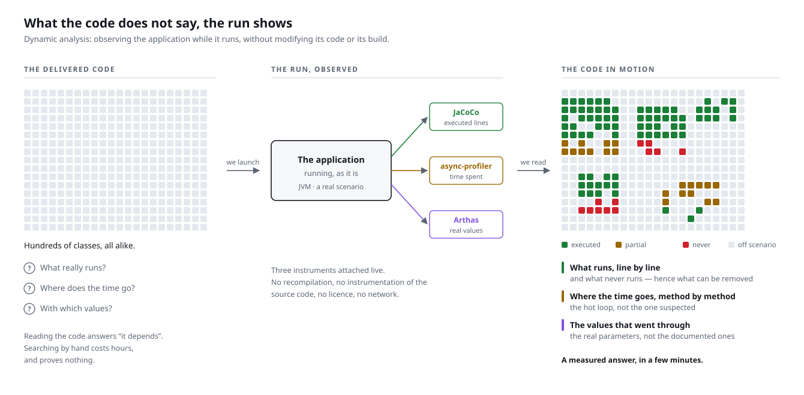
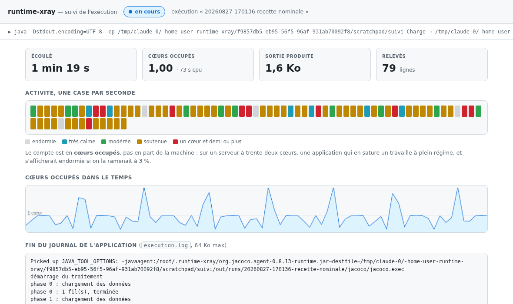

# Runtime X-Ray

A test bench. The starting instruction, given to [Claude](https://claude.com/claude-code)
and held to the end:

> *Survey the state of the art of dynamic analysis of Java code, in a purely open-source
> environment.*

This whole repository follows from it. The survey of the tools, the comparison, the choice of
the combination retained, the code that assembles them and the page produced: it is the
unfolding of a single instruction, held with no budget, no licence to buy and nothing to
deploy.

The result is [a report produced on a real
run](https://beennnn.github.io/runtime-xray/multi/) — [how to read
it](docs/outil/lire-le-rapport.md).

**Two test benches, then, and the second one is owned.** The exercise measures the state of
the art of dynamic analysis as much as what a coding assistant can produce when handed an
open question, with no specification and no business domain — see [The second test
bench](#the-second-test-bench-the-assistant).

## Subject

Taking over existing Java code one did not write is an ordinary engineering problem, and
reading alone answers it badly: it shows every possible path, never the one that was taken.
Dynamic analysis answers the real question — *what actually executes?*

The study therefore bears on a general question, asked with no particular application in
mind: **which tools allow observing a recent Java run, and what are they worth?** The three
pieces of information sought:

1. the lines executed;
2. the tree of calls;
3. as a second-priority option, the values passed as arguments.

The purpose: to have a factual basis for analysing, restructuring and redefining existing
code — rather than relying on reading alone.

## Dynamic analysis, in two words

**Static** analysis examines code without executing it: it sees every possible path,
including those nobody ever takes. **Dynamic** analysis examines a program's properties
*while it runs*: it sees only one path, but it really sees it. The two are complementary —
one is exhaustive and imprecise, the other precise and partial.

The reference definition is Thomas Ball's, [*The Concept of Dynamic
Analysis*](https://doi.org/10.1007/3-540-48166-4_14) (ESEC/FSE 1999, LNCS 1687) —
[free PDF](https://citeseerx.ist.psu.edu/viewdoc/download?doi=10.1.1.89.7736&rep=rep1&type=pdf).
For the use that concerns us here — understanding an existing program — the state of the art
is surveyed by Cornelissen *et al.*, [*A Systematic Survey of Program Comprehension through
Dynamic Analysis*](https://repository.tudelft.nl/file/File_088913b9-c238-4671-b35f-c87e4b037a04)
(IEEE TSE 35(5), 2009), which classifies 176 works in the field.
A shorter entry point: [Dynamic program
analysis](https://en.wikipedia.org/wiki/Dynamic_program_analysis) on Wikipedia.

## What one is trying to get out of it

The situations below are the ones that framed the study. They are deliberately ordinary —
they are the cases where reading the code costs more than running it.

| Situation | What the run shows, and reading does not |
|---|---|
| **Taking over code whose author has left** | Which branches really live. An `if` on a configuration flag has two halves in the source; at run time, only one is taken |
| **Finding dead code before a refactoring** | The coverage of a **real run**, which is not the coverage of the tests: code covered by a test may never be reached in production, and the converse happens just as often |
| **Understanding why two runs diverge** | The values passed to the same methods, side by side. It is the argument that changes, not the code, that nearly always explains the difference |
| **Mapping a dependency delivered without sources** | The call tree is reconstructed from the bytecode: an opaque internal jar becomes readable without having its repository |
| **Preparing a split or an extraction** | Who calls whom **for real**. The static call graph always overestimates coupling, because it counts edges nobody takes |
| **Checking that an error path is used** | If a `catch` is never reached on any scenario, it is either dead code or a missing test. Reading does not settle it |
| **Freezing a behaviour before rewriting it** | A dated execution trace acts as a characterisation test: one will know whether the rewrite changes anything |

These are ordinary software-engineering needs, independent of any business domain: they arise
the same way on a banking back office, a computation engine or a batch process.

## What the tool is, and what it is not

The orchestrator **analyses nothing itself**. It does not instrument, does not profile, does
not read bytecode. It launches the application, lets three free and public tools do all the
observation work, then **aggregates their outputs** into a single page:

| Tool | Licence | What it produces |
|---|---|---|
| [JaCoCo](https://www.jacoco.org/) | EPL 2.0 | The coverage XML — the lines executed |
| [async-profiler](https://github.com/async-profiler/async-profiler) | Apache 2.0 | The sampled stacks — the aggregated tree |
| [Arthas](https://arthas.aliyun.com/) | Apache 2.0 | The call traces and the observed values |

All the analytical value comes from those three projects. This repository brings only the
glue: reading three heterogeneous formats, matching them up by class and by line, and making
a page out of it that reads at a glance. It is presentation work, not measurement.

## The second test bench: the assistant

The repository has a second reason for being, as owned as the first. The instruction — *survey
the state of the art of dynamic analysis of Java code, in a purely open-source environment* —
is a good gauge of what a coding assistant can do today: it is open, with no specification, no
business domain, it requires surveying and then deciding, and it has an output one can judge
at a glance — either the page reads, or it does not.

It also constrains the result usefully: **purely open source** forbids dodging the difficulty
by buying a tool that does everything. It is that constraint which forced the answer to three
tools rather than one, and hence all the assembly work.

This repository's code was therefore written with [Claude
Code](https://claude.com/claude-code), and the exercise was as much about obtaining the tool
as about observing how one obtains it. What was measured in doing it:

| | |
|---|---|
| Volume produced | 2,623 lines of code, 1,640 lines of test, 98 tests, in one evening |
| Complete rewrite | The first version was a shell script + a Python script; it was redone in Java with no dependency, in one go, keeping the behaviour |
| What took the most back and forth | The HTML page — not the logic. Matching three formats is mechanical; deciding *what to show and what to fold away* is not, and that happened through successive iterations on the rendering |
| What did not work on its own | The comparison's claims. An assistant will readily produce a plausible sentence about a tool it has not run — hence the **verification status** carried by every line of the [comparison](docs/etude/comparatif.md), which tells apart what was executed from what comes from the documentation |

That last point is the more interesting of the two test benches, and it shaped the method:
the rule "no claim without its status" is not an author's precaution, it is the direct
counter-measure to the defect observed.

## Parameters of the study

The criteria below are the ones I set myself to tell the tools apart. They are deliberately
ordinary: they are the everyday constraints of a development machine in a company, with no
reference to any particular environment.

| Parameter | Consequence for the selection |
|---|---|
| Offline execution | Rules out hosted services. Downloading the components beforehand stays possible |
| Java 21 at least | Java 21 is the current industrial standard, after Java 8 then Java 11 in recent years: it is the base targeted. Java 25 is evaluated as well, and the difference measured is reported in the [results](docs/resultat/resultats.md#gains-from-a-port-to-java-25-no-gain-visible-in-the-report) |
| A common IDE | IntelliJ as the reference, without depending on it: the paid edition is not assumed available |
| Two audiences | A developer in their environment, and a non-technical reader in front of a document passed on to them |
| One-off diagnosis | No server to deploy or maintain |

Computation time and memory are recorded for information, but are not part of the selection
criteria. Performance optimisation is a separate subject, which supposes the code is
understood first.

## What dynamic analysis brings



Reading the code answers "it depends". Running it under observation answers with
measurements: which lines ran, where the time went, which values circulated. The three
instruments attach to a live JVM — no recompilation, no source-code instrumentation, no
licence, no network at run time.

This diagram is SVG: it imports as it is into a presentation and stays sharp at any size.

## Approach


Eighteen tools were surveyed, then evaluated against five ordered criteria: ease of setting
up, readability of the report for a non-technical reader, functional coverage, IDE
integration, cost. Every claim in the comparison carries a status saying whether it was
verified by running the tool or taken from the vendor's documentation.

The protocol and the criteria are described in [the method](docs/etude/methode.md).

## Result

None of the tools examined answers the three questions on its own. A combination of three
free tools does, within the limits stated below:

| Tool | Licence | What it brings |
|---|---|---|
| JaCoCo | EPL 2.0 | The lines executed, exhaustively |
| async-profiler | Apache 2.0 | The time measurements and the aggregated tree of calls |
| Arthas | Apache 2.0 | The argument values, and the path followed by a given call |

Their outputs are assembled into a single page by an orchestrator written for this study. The
detail of the arrangement and its caveats are in [the solution
retained](docs/resultat/solution.md).


The page brings together two ways into the same code: the code arranged by package, and the
runs presented as a call tree — it is that second way in that is open above.

The lines executed appear in green, those never reached in red. To the right of each line,
the calls that leave it, with the number of passes and the spread of the durations observed:
`×10` on a line inside a loop unfolds into one node per iteration. At the bottom, the observed
calls are placed side by side, one column per field, the columns that vary flagged — that is
where one reads what made two runs of the same method diverge.

An example produced by this combination is [viewable
online](https://beennnn.github.io/runtime-xray/multi/).

## Scope and limits of the study

These results hold within the frame described, and no further. In particular:

- The commercial tools were not run. JProfiler, YourKit and the others are evaluated on their
  documentation and their public screenshots. The steps for obtaining evaluation keys are
  described in [the evaluation keys](docs/etude/cles-evaluation.md), but they were not taken.
  What one would expect of them is stated, not observed.
- A single demonstration program served as the support, on a single machine (macOS, Apple
  Silicon). The behaviour on an industrial codebase — several thousand classes, several
  threads, an application server — was not observed.
- Capturing the values disturbs the time measurement: it is carried out in the same run, which
  overestimates the cost of the observed method. The caveat is shown in the report and
  quantified; it is accepted because time is not a criterion.
- Values are captured on one method only, named at launch. Observing every method would
  produce an unmanageable volume.
- The difference between Java 21 and Java 25 was measured on this one program and showed no
  gain for the combination retained. That says nothing about other cases.

## Getting the tool

**An already-built jar, nothing else.** No clone, no build, no account:
[**download `runtime-xray-cli-1.2.2.jar`**](https://github.com/Beennnn/runtime-xray/releases/latest)
and run it.

```bash
curl -LO https://github.com/Beennnn/runtime-xray/releases/download/v1.2.2/runtime-xray-cli-1.2.2.jar
java -jar runtime-xray-cli-1.2.2.jar --java "java -jar target/my-app.jar"
```

| | |
|---|---|
| Version | `1.2.2` |
| Size | ~175 KB |
| Dependencies | none, outside the JDK |
| Java | 21 or later |
| Licence | 0BSD — `1.0.0`, for its part, had been published under MIT |

The sources and the javadoc come with the same download.

For a machine where nothing can be prepared, **two other editions are built from source**:
they carry their analysis components and therefore need no network, ever — see
[below](#one-single-file-the-jar-that-carries-its-components).

### Preparing a machine with no network

This is the use case that motivated the whole study. The tool needs its three analysis
components, and **once only**: after that they live in `~/.runtime-xray` and nothing goes out
on the network any more. The whole question is how they get there the first time.

Three ways of going about it, from the simplest to the most flexible.

#### One single file: the jar that carries its components

```bash
mvn -Pjacoco  -DskipTests package   # → runtime-xray-jacoco.jar   (950 KB)
mvn -Pcomplet -DskipTests package   # → runtime-xray-complet.jar  (19 MB)
```

The same tool, with its components bundled. One carries it onto the closed machine and runs
it: it drops them into `~/.runtime-xray` on first launch, and nothing goes out on the network.
Nothing to copy, nothing to unzip.

| Edition | Weight | What works with no network |
|---|---|---|
| `runtime-xray.jar` | 170 KB | nothing in advance: the components are to be found elsewhere |
| `runtime-xray-jacoco.jar` | 950 KB | **coverage** |
| `runtime-xray-complet.jar` | 19 MB | coverage, **times** and **values** |

The difference between the last two is Arthas, 17 MB on its own for capturing values. The
light edition is the right default when only coverage matters; what it lacks stays
recoverable by the routes above, and the error message says so.

Those two jars **redistribute** JaCoCo (EPL-2.0), and the complete edition adds
async-profiler and Arthas (Apache-2.0) — that is what sets them apart from the ordinary jar,
which redistributes nothing. See [THIRD-PARTY.md](THIRD-PARTY.md). They are not published on
Maven Central: the 170 KB jar stays the normal artefact.

#### The kit, if one wants to see what is being carried

[`bin/offline-kit.sh`](bin/offline-kit.sh) assembles the package to carry — the jar, the three
components, their fingerprints and the instructions:

```bash
bin/offline-kit.sh                                            # from Maven Central
MAVEN_REPO=https://mirror.internal/maven2 bin/offline-kit.sh  # from a mirror

# → target/runtime-xray-offline-kit.zip (~19 MB, 17 of them for Arthas)
```

It only downloads: no application to observe, no analysis to carry through. That is what sets
it apart from the other way of filling the cache — running any analysis on a machine that has
access — which supposes a platform where async-profiler exists, hence not Windows.

```bash
# The other way, if an analysis already succeeds on the connected machine
java -jar runtime-xray-cli-1.2.2.jar --java "java -version"
tar czf runtime-xray-offline.tgz -C ~ .runtime-xray
```

On the isolated machine, unpack and copy `.runtime-xray` into `$HOME`: the tool will open no
connection. If an internal Maven mirror is reachable, `--repo` or `MAVEN_REPO` sends it there
and the cache fills itself from inside the network.

#### If the components are already on the machine

That is often the case: a machine that builds Java already has JaCoCo in its local Maven
repository, and whoever prepared the intervention often has the file on their stick. The tool
therefore looks, **before** any trip to the network:

| Order | Place | How to put the files there |
|---|---|---|
| 1 | `~/.runtime-xray` | the cache the tool fills itself |
| 2 | `--components <dir>` (or `COMPONENTS=`, or `RUNTIME_XRAY_COMPOSANTS`) | a named directory |
| 3 | the jar's directory, and its `composants/` sub-directory | put the file beside the jar |
| 4 | `~/.m2/repository` (or `MAVEN_REPO_LOCAL`) | nothing to do: it is the local Maven repository |
| 5 | the network | last resort |

The names expected are Maven's (`org.jacoco.agent-0.8.13-runtime.jar`), but the official
distributions' names are accepted too — `jacocoagent.jar`, `jacococli.jar`, `arthas-bin.zip`,
or an already-unzipped Arthas. The tool then says which file it took and recalls that the
version is, in that case, not verified.

When a component really is missing, the message lists every path tried and the two ways out
(`--components`, `--repo`): on a closed machine, that message is what must suffice to get out
of it without going back to the sources.

### Checking that it works — two acceptance runs

[`bin/acceptance-published.sh`](bin/acceptance-published.sh) fetches the **published** artefact
into a fresh directory, checks its signature with a key retrieved from a public server — as a
third party would — then **runs it on a real application** and checks that the page, the
Markdown report, the coverage and the profile are produced. It further tests what the version
under test can do — exports, levels, served report — and tells three outcomes apart: passed,
failed, and **out of scope** when the version does not carry the feature or the network does
not allow a conclusion. Counting an impossible check as a failure would make a valid artefact
look like a doubtful one.

[`bin/acceptance-local.sh`](bin/acceptance-local.sh) does the same work on the jar **one is
about to publish**, and goes to the end of the chain: a complete analysis with value capture,
the four exports and their shape, the observation level that does not sample, and the
annotation server — writing into the run's directory, refusing a stale write, regenerating the
page, refusing a path that leaves the served directory.

```bash
mvn -q package && ./bin/acceptance-local.sh   # checks on what is about to be published
./bin/acceptance-published.sh                 # on what is published, version by version
```

An HTTP 200 says a file exists; it does not say it works. That is the difference between
"published" and "usable". And the unit tests check decisions one at a time, without ever
launching an observed JVM: only an acceptance run says the pieces, end to end, still work
together.

## The tool

The orchestrator is a jar with no dependency outside the JDK. It executes the command
supplied as it is and injects the observers through `JAVA_TOOL_OPTIONS`, which every JVM
reads at start-up; neither the analysed code nor the build is modified.

```bash
java -jar runtime-xray.jar \
  --java "java -jar target/my-app.jar" \
  --root "com.example.Calculator::compute" \
  --sources src/main/java
```

The report is written to `runtime-xray-out/index.html`.

The page opens **in English**; the `EN | FR` selector in its header switches everything it
shows, and a browser that announces French gets it straight away.

`--sources` commands **the display of the annotated code** and nothing else: without it the
measurement is identical, but each class opens on a panel explaining what is missing rather
than on code. The directory's level does not matter — the tool reads the package each file
declares, not its path — so `--sources my-project` works as well as
`--sources my-project/src/main/java`.

### When the report does not show what was expected

At every assembly, the tool writes `runtime-xray-out/diagnostic.json` beside the page:
environment, launch configuration, roots actually opened, runs and reports present,
class-by-class matching. It is the file to attach when asking for help — it carries the
answers one would have asked as questions. It holds neither a server token nor captured
argument values.

When measured classes have no code, the tool **looks for the sources around the project** and
offers the directories to add — each with what it would resolve:

```
   sources: 0/27 measured class(es) have their code
   roots found, to add to SOURCE_DIRS:
     /home/me/project/src/main/java   (resolves 27/27 of the classes without source)
```

Several roots are separated by `:` — or by `;` under Windows, where an absolute path itself
starts with `C:`. Both work everywhere.

A root is offered only if the **package declared** by the files it holds matches what the
coverage is asking for: a file with the right name coming from another project does not count.
When nothing matches, the tool says so rather than inventing.

The same thing reads in the page, in the **"Source analysis"** section of the overview: the
line actually executed, the bytecode and source roots with what each one returned, a tree
package by package coloured according to what each class is missing, and a search that answers
"this class — did you find it, and where?".

**Beware of widening the wrong setting.** Four options each restrict something different, and
that is the costliest confusion — one re-runs and gets exactly the same report:

| Setting | Acts on | Does **not** act on |
|---|---|---|
| `--sources` | the display of the annotated code | the measurement, which is identical without it |
| `--root` | the capture of values, and the default time filter | the coverage, the classes shown, the sources |
| `--filter` | the classes sampled — the **time** | the coverage, the code displayed |
| `--cover` | the classes instrumented — the **coverage** | the time profile |

The table is repeated in the page, with an alert on the rows the run's configuration makes
suspect.

### Several runs, one reading

Ticking **"accumulate the coverage of the ticked runs"**, on the left, brings the selected
runs together in one view of the code: a line is green as soon as one run reached it, and
numbered pills say **which ones**. That is the question one asks after an acceptance campaign,
and one that ten separate reports answer only by hand.

From two runs onwards, the tool also produces `jacoco-fusion/` — JaCoCo's report on the merged
measurements (`merge` then `report`), for the figure that counts. It is linked from the
**Exports** menu. It cannot, for its part, say which run covered what: once the `.exec` files
are added up, that information no longer exists.

The bytecode to analyse is not asked for: it is read from the observed JVM's real arguments,
which holds too for a launcher that hides the command. When those arguments do not carry the
application classpath — the case of `mvn exec:java`, where the application runs inside Maven's
JVM — the project's layout takes over, if it really exists. `--classes` stays available for
analysing something else: an internal dependency delivered compiled, a "fat" jar, or one
precise module.

The analysis components are looked for **on the machine** first — the `~/.runtime-xray` cache,
a directory named by `--components`, the jar's neighbourhood, the local Maven repository, and
the bundled components if it is an edition that carries them. Downloading from a Maven
repository, the publisher's or an internal mirror, is only the last resort; what comes from it
is cached, and the following runs no longer reach the network. The detail: [Preparing a machine
with no network](#preparing-a-machine-with-no-network).

Every report records its own context: command launched, root method, filters, start and end
times, duration, machine, system, Java version.

### On a large codebase: measuring by levels

The three pieces of information have neither the same value nor the same cost, and on an
enterprise application one does not take them all on the first go. The order of priority is
fixed: **coverage first**, because it is the only exhaustive one and the only one to show what
did *not* run; **the call tree next**; **the values last**, once one already knows which method
to look at.

```bash
# 1. the cheapest: coverage alone, restricted to the project's code
java -jar runtime-xray.jar --level coverage --cover "com.example.*"   --java "java -jar app.jar" --sources src/main/java

# 2. + the call tree, sampled ten times less often
java -jar runtime-xray.jar --level tree --interval 10 --cover "com.example.*"   --java "java -jar app.jar" --sources src/main/java

# 3. + one method's values: the default
java -jar runtime-xray.jar --root "com.example.Engine::compute"   --java "java -jar app.jar" --sources src/main/java
```

The most effective lever is not the level but `--cover`: without it, JaCoCo instruments **every
class the JVM loads**, framework and drivers included — code nobody intends to read. The detail
of the levers, and a procedure for an application one does not know: [Reducing the footprint on
a large codebase](docs/outil/empreinte.md).

### Annotating the runs: in the browser, on your own machine, or together

A run is named, described, labelled, and its call tree pruned to show only the branch that
matters. These annotations live wherever one wants, and the three modes coexist — the same
format, no conversion to move from one to the next:

| Mode | How | What it gives |
|---|---|---|
| **Each in their own browser** | open the page, annotate | immediate, nothing to install; export gives a file, import takes in a colleague's |
| **On your own machine** | `--serve` | the page writes beside the runs and the report is regenerated: the annotation is secured |
| **Shared server** | `--serve --serve-host 0.0.0.0` | results are dropped there — taken into account with no restart — everyone reads and **annotates in parallel** without overwriting each other |

```bash
java -jar runtime-xray.jar --report-only --out runtime-xray-out --serve
```

A shared server is closed with `--serve-token`: with no value, a secret is drawn at random and
shown once; visitors type it on an entry page and the session lasts twelve hours. It is a
shared secret, not accounts — it says who may enter, not who wrote what — and **over plain
HTTP it travels in the clear**: it complements network filtering, it does not replace it.

A run's annotation is written **in its own directory** (`config.json`), which makes it travel
with the measurement; a `<run>-config.json` file placed beside it, or the shared `noms.json`,
are still read — in that order of priority. On a shared server, a write bears on one run at a
time: two people do not overwrite each other, and whoever arrives second sees the recorded
version before deciding.

All the detail — the three modes, concurrent writing, the locations, the formats and the
caveats: [Annotating the runs](docs/outil/annotations.md).

### Taking the measurement into another tool

The page is **one** way of reading a run, not the only one. `--export` rewrites the same
measurements into public formats — the measurement, not the summary: none of the page's
foldings or hidings apply to them.

```bash
java -jar runtime-xray.jar --report-only --out runtime-xray-out --export all
```

| File | Format | What opens it |
|---|---|---|
| `profil.perf.txt` | output of `perf script` | Firefox Profiler |
| `profil.cpuprofile` | Chrome DevTools CPU profile | speedscope, the browsers' developer tools |
| `couverture.lcov` | LCOV | `genhtml`, Coverage Gutters, the tracking services |
| `valeurs.json` | documented JSON | a script that compares two runs |

The survey of open formats — those chosen and those rejected, with the reason — is in [Taking
the result into another tool](docs/outil/exports.md).

Beside the page, `faits.jsonl` carries the same conclusions **as one JSON object per line**,
each understood on its own — including what was *not* measured, without which a zero reads as
a finding. `--context "a question"` draws a bounded extract from it, ready to hand over:
[Having the report read by an AI](docs/outil/integration-ia.md).

### Following a run while it happens



An analysis lasts as long as the observed application. `progression.jsonl` is **always**
written at the root of the output, one JSON line per second: `tail -f
runtime-xray-out/progression.jsonl` is enough, including where the tool is launched deep in
nested scripts and nothing shows any more. `--follow` further serves a page that re-reads that
same file and shows the *shape* of the run — the activity second by second, the busy cores, the
output growing or no longer growing.

**None of this measures anything**: the processor time is the one the system counts anyway, the
output size that of a file already written. The report is the same whether one follows the run
or not.

[Full manual](docs/outil/mode-emploi.md) — settings, configuration file, choosing the root
method, publishing the result.
[Reading the report](docs/outil/lire-le-rapport.md) — what the page shows, what it folds away,
and why.

## Documents

Three folders, according to the question dealt with.

**`docs/etude/` — the research**

| Page | Content |
|---|---|
| [Method](docs/etude/methode.md) | Criteria, order of priority, verification protocol |
| [Comparison](docs/etude/comparatif.md) | The 18 tools, with the verification status of every claim |
| [Sheets per tool](docs/etude/fiches) | One page per tool: capabilities, licence, limits |
| [Tools rejected](docs/etude/outils-ecartes.md) | The rejections, with reasons and dates |
| [Evaluation keys](docs/etude/cles-evaluation.md) | Steps for trying the commercial tools |

**`docs/resultat/` — the conclusions**

| Page | Content |
|---|---|
| [Solution retained](docs/resultat/solution.md) | The arrangement, the protocol, and its caveats |
| [Results and trade-offs](docs/resultat/resultats.md) | What is decided, what stays open |
| [Formats and decoupling](docs/resultat/formats.md) | Changing the display without changing the collection |
| [Publishing the report](docs/resultat/publication.md) | Where to put an HTML page so that it is readable |

**`docs/outil/` — the usage**

| Page | Content |
|---|---|
| [Manual](docs/outil/mode-emploi.md) | Settings, configuration, root method |
| [Annotating the runs](docs/outil/annotations.md) | Naming, describing, labelling, pruning — alone, on your own machine, or together |
| [Reducing the footprint](docs/outil/empreinte.md) | Running the tool on a large codebase: three observation levels, and the levers |
| [Taking the result elsewhere](docs/outil/exports.md) | `perf`, `cpuprofile`, LCOV exports — for Firefox Profiler, speedscope, an editor |
| [Reading the report](docs/outil/lire-le-rapport.md) | What the page shows, what it folds away, and what one can ask of it |
| [Having the report read by an AI](docs/outil/integration-ia.md) | `faits.jsonl`, `--context`, and the three levels of effort for questioning a campaign |
| [Two ready-made skills](skills/README.md) | What an assistant must know before running a campaign, and before reading one |
| [Technical details](docs/outil/technique.md) | Demonstration program and difficulties met |
| [Distribution](docs/outil/distribution.md) | How one puts the tool into someone else's hands |

## Layout of the repository

| Directory | Content |
|---|---|
| `orchestrator/` | The tool: a Maven module with no runtime dependency |
| `sample-app/` | The demonstration program: a travel-time computation whose call graph depends on the context, with code deliberately never executed |
| `tools/` | The study's manual protocol: each tool's native invocation, kept so that the comparison's claims stay checkable |
| `bin/` | The supporting scripts: the two end-to-end acceptance runs, and the assembly of the offline kit |
| `skills/` | Two skills to copy into your project: running a campaign, and reading a report — see [their README](skills/README.md) |
| `docs/` | The study |
| `CLAUDE.md` | What to know before touching the repository: building, publishing, conventions, work in progress |
| `.github/workflows/` | The tests on every pull request, the publication of a version when a `v*` tag is pushed, and that of the landing page when its source changes |
| `site/` | The landing page's source: `site/index.html` is copied onto `gh-pages` by a workflow, there is nothing to do by hand |

**Publishing a version**: pushing a tag is enough. The build happens on a server, from that
tag's code exactly, and the three editions are attached to the release with their
fingerprints. Binaries are never versioned in the repository — git would keep every copy for
ever, and a 19 MB complete jar would weigh down every clone to come.

```bash
git tag v1.3.0 && git push origin v1.3.0
```

The tag must match the pom's version: otherwise publication stops there, rather than putting
out a badly named artefact.

To reproduce the demonstration:

```bash
mvn -q clean package
java -jar orchestrator/target/runtime-xray.jar \
  --java "java -jar sample-app/target/sample-app.jar" \
  --root "lab.sample.RoutePlanner::travelTimeMinutes" \
  --sources sample-app/src/main/java
```

## Origin

A personal project, carried out in my own time and on my own hardware, on a question any Java
developer faced with existing code asks themselves: *how does one observe what actually
executes?*

### The continuation of an earlier project

This repository extends [**Iris**](https://github.com/iris7-app/iris-service-java), begun in
May 2026: a public Java demonstrator whose central axis is **observability** — traces, logs
and metrics of a system in operation, with its SLOs and its dashboards.

The same approach, a neighbouring subject. Iris answers *what is my system doing in
production?* It leaves untouched the question one notch below: *what does this code do, line
by line, when I take it over without having written it?* Application observability does not go
down that far — it instruments what one decided to instrument, and it is precisely the code
one does not yet know that one did not know how to instrument. `runtime-xray` deals with that
notch.

The two projects share their choices, settled in the first and taken up unchanged:

| | Iris | runtime-xray |
|---|---|---|
| Java base | 21 LTS targeted, 25 evaluated for compatibility | 21 LTS targeted, 25 evaluated |
| Coverage | JaCoCo, blocking threshold | JaCoCo, as the source of truth about the run |
| Traceability of claims | 60+ ADRs, dated audits | verification status on every line of the comparison |
| Licence | BSD 3-Clause, named holder | 0BSD, named holder |

## Licence

[0BSD](https://spdx.org/licenses/0BSD.html) — see [LICENSE](LICENSE). The no-warranty clause
is kept: the tool injects agents into the JVM of an application that is not its own.

Third-party code present in the repository keeps its own licence — see
[THIRD-PARTY.md](THIRD-PARTY.md). Version `1.0.0`, already published, is under MIT.
