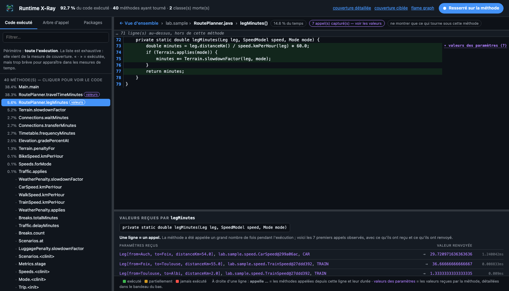

<p align="center">
  
</p>

# Runtime X-Ray

**Voir ce qu'une exécution Java a réellement fait** : par où le code est passé, quel appel
en a déclenché un autre, et avec quelles valeurs. Le tout dans **une page**, produite par
une seule commande, sans licence et sans connexion pendant l'exécution.

**[▶ Voir un exemple](https://beennnn.github.io/runtime-xray/vue-integree/)** ·
**[Le lancer sur votre projet](docs/outil/mode-emploi.md)** ·
[Télécharger un rapport type](https://github.com/Beennnn/runtime-xray/releases/latest)

---

## Ce que ça donne



À gauche, **tout le code qui a tourné**, du plus coûteux au moins coûteux. Un clic ouvre la
méthode : lignes exécutées en vert, jamais atteintes en rouge, et à droite de chaque ligne
les appels qui en partent avec leur durée. En bas, **les valeurs reçues à chaque appel** et
ce qui a été renvoyé.

| | |
|---|---|
| **Par où le code est passé** | Ligne à ligne, y compris ce qui n'a **jamais** tourné |
| **L'arbre d'appel** | Qui appelle qui, avec la part de temps de chaque branche |
| **Les valeurs des paramètres** | Ce que la méthode a réellement reçu, appel par appel |
| **Le contexte d'appel** | Par quels chemins une méthode a été atteinte, et dans quelle proportion |

Trois portes d'entrée — **code exécuté**, **arbre d'appel**, **packages** — mènent au même
code. Le mode *resserré*, actif par défaut, n'affiche que la méthode choisie, sans ses
lignes mortes : on regarde **une méthode à la fois**.

## Le lancer sur votre projet

Aucune contrainte sur la façon de lancer Java — les agents sont injectés par
`JAVA_TOOL_OPTIONS`, que toute JVM lit au démarrage.

```bash
java -jar runtime-xray.jar \
  --java "java -jar target/mon-appli.jar" \
  --root "com.exemple.Calculateur::calculer" \
  --classes target/mon-appli.jar \
  --sources src/main/java
```

`--classes` accepte un répertoire **ou le jar livré**, y compris un jar « gras » dont les
dépendances sont elles-mêmes des jar : elles sont analysées avec le reste.

```bash
open runtime-xray-out/index.html
```

Fonctionne aussi avec `mvn exec:java`, `./gradlew run` ou un script maison. Le code analysé
n'est pas modifié, le build non plus.

**[→ Mode d'emploi complet](docs/outil/mode-emploi.md)** : paramètres, fichier de configuration, choix
de la méthode racine, publication du résultat (GitLab, Confluence, un lien depuis GitHub).

## Ce que ça coûte

| | |
|---|---|
| Licence | **aucune** — trois outils libres : JaCoCo, async-profiler, Arthas |
| Connexion **pendant l'exécution** | **aucune** |
| Connexion pour installer | une fois, depuis Internet ou un miroir Maven interne |
| Java | 21 et 25 vérifiés — le résultat est identique |

Le rapport enregistre son propre contexte : programme lancé et ses arguments, heure de
début et de fin, durée, machine, système, version de Java. Un rapport retrouvé dans six
mois dit de quoi il parle.

## Le besoin, et les contraintes

Mettre en place des outils d'analyse dynamique pour un code Java permettant, à l'exécution
d'une fonction, de récupérer les **lignes exécutées** et l'**arbre d'appel** — et, en
option de seconde priorité, les **valeurs passées en paramètres**. But final : analyser,
restructurer et redéfinir le code à partir de ces données.

| Contrainte | Conséquence |
|---|---|
| 🔌 **Exécution hors ligne** | Élimine tout SaaS. Le téléchargement préalable, lui, est libre |
| ☕ **Java 21, Java 25 à évaluer** | Les deux sont vérifiés ; l'écart est [mesuré](docs/resultat/resultats.md#gains-dun-portage-vers-java-25) |
| 🧭 **IntelliJ comme IDE cible** | Sans en dépendre : tout le monde n'a pas l'édition payante |
| 👥 **Deux publics** | Un développeur dans son IDE, un non-technicien devant une page qu'on lui envoie |
| 🎯 **Diagnostic ponctuel** | Pas de serveur à déployer ni à maintenir |

**Hors critères** : le temps de calcul et la mémoire sont mesurés à titre indicatif.
L'optimisation des performances est un sujet distinct, à traiter plus tard — une fois le
code compris, puis reconçu avec ses propres contraintes.

## Comment on en est arrivé là

Dix-huit outils ont été recensés et comparés avant d'aboutir à cette combinaison. Le détail
est en pages secondaires, pour qui veut vérifier ou reprendre l'évaluation :

Les documents sont rangés en trois dossiers, selon la question à laquelle ils répondent —
**comment on a cherché**, **ce qu'on a trouvé**, **comment on s'en sert** :

**`docs/etude/` — comment on a cherché**

| Page | Ce qu'on y trouve |
|---|---|
| [Méthode](docs/etude/methode.md) | Les critères, leur ordre, et le protocole de vérification |
| [Comparatif](docs/etude/comparatif.md) | Les 18 outils, avec le statut de vérification de chaque affirmation |
| [Fiches par outil](docs/etude/fiches) | Une page par outil : philosophie, capacités, licence, limites |
| [Outils écartés](docs/etude/outils-ecartes.md) | Les rejets, motivés et datés |
| [Clés d'évaluation](docs/etude/cles-evaluation.md) | Si l'on veut essayer les outils commerciaux |

**`docs/resultat/` — ce qu'on a trouvé**

| Page | Ce qu'on y trouve |
|---|---|
| **[La solution retenue](docs/resultat/solution.md)** | Le montage, le protocole, et ses réserves assumées |
| [Résultats et arbitrages](docs/resultat/resultats.md) | Ce qui a été décidé, ce qui reste ouvert |
| [Formats et découplage](docs/resultat/formats.md) | Changer d'affichage sans changer la collecte |
| [Publier le rapport](docs/resultat/publication.md) | Où déposer une page HTML pour qu'elle se lise |

**`docs/outil/` — comment s'en servir**

| Page | Ce qu'on y trouve |
|---|---|
| **[Mode d'emploi](docs/outil/mode-emploi.md)** | Paramètres, configuration, choix de la méthode racine |
| [Détails techniques](docs/outil/technique.md) | Le programme de démonstration et les pièges rencontrés |
| [Diffuser l'outil](docs/outil/distribution.md) | Maven Central, dépôt interne, et ce que la réécriture a apporté |

**En une phrase** : aucun outil ne répond seul aux trois questions, mais **trois outils
gratuits y suffisent**, et une licence commerciale n'apporterait que sur l'option de
seconde priorité.

## Ce dépôt

`sample-app/` est un programme de démonstration — un calculateur de temps de trajet dont le
graphe d'appel dépend du contexte, avec du code volontairement jamais exécuté. Pour
reproduire la démonstration :

```bash
./tools/run-all.sh
open reports-demo/generated/index.html
```

## Licence

MIT — voir [LICENSE](LICENSE).
