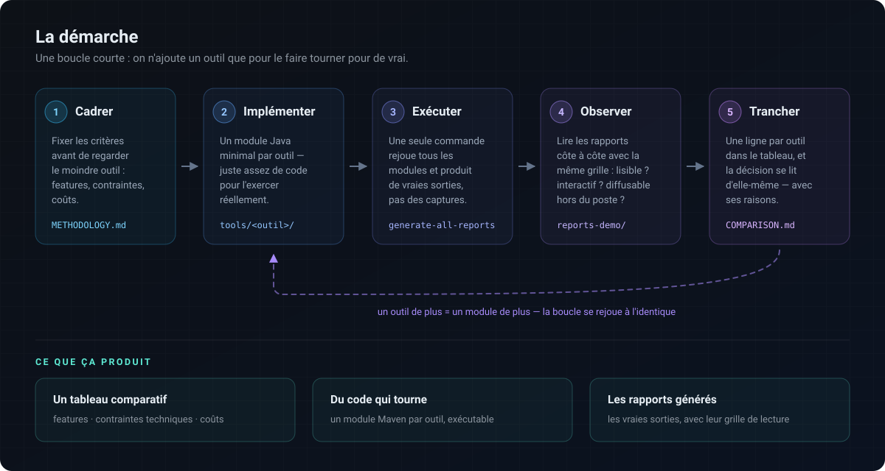

# Runtime X-Ray

Un banc d'essai. La consigne de départ, donnée à [Claude](https://claude.com/claude-code)
et tenue jusqu'au bout :

> *Fais l'état de l'art de l'analyse dynamique de code en Java, dans un environnement
> purement open source.*

Tout ce dépôt en découle. Le recensement des outils, la comparaison, le choix de la
combinaison retenue, le code qui les assemble et la page produite : c'est le déroulé d'une
seule consigne, tenue sans budget, sans licence à acquérir et sans rien à déployer.

Le résultat est [un rapport produit sur une exécution
réelle](https://beennnn.github.io/runtime-xray/multi/) — [comment le
lire](docs/outil/lire-le-rapport.md).

**Deux bancs d'essai, donc, et le second est assumé.** L'exercice mesure autant l'état de
l'art de l'analyse dynamique que ce qu'un assistant de code sait produire quand on lui
confie une question ouverte, sans spécification et sans domaine métier — voir [Le second
banc d'essai](#le-second-banc-dessai--lassistant).

## Objet

Reprendre du code Java existant qu'on n'a pas écrit est un problème d'ingénierie ordinaire,
et la lecture seule y répond mal : elle montre tous les chemins possibles, jamais celui qui
a été pris. L'analyse dynamique répond à la question réelle — *qu'est-ce qui s'exécute,
vraiment ?*

L'étude porte donc sur une question générale, posée sans cas d'application particulier :
**quels outils permettent d'observer une exécution Java récente, et que valent-ils ?** Les
trois informations recherchées :

1. les lignes exécutées ;
2. l'arbre des appels ;
3. en option de seconde priorité, les valeurs passées en paramètres.

Finalité : disposer d'une base factuelle pour analyser, restructurer et redéfinir un code
existant — plutôt que de s'en remettre à la lecture seule.

## L'analyse dynamique, en deux mots

L'analyse **statique** examine le code sans l'exécuter : elle voit tous les chemins
possibles, y compris ceux que personne n'emprunte jamais. L'analyse **dynamique** examine
les propriétés d'un programme *en cours d'exécution* : elle ne voit qu'un chemin, mais elle
le voit vraiment. Les deux sont complémentaires — l'une est exhaustive et imprécise,
l'autre précise et partielle.

La définition de référence est celle de Thomas Ball, [*The Concept of Dynamic
Analysis*](https://doi.org/10.1007/3-540-48166-4_14) (ESEC/FSE 1999, LNCS 1687) —
[PDF libre](https://citeseerx.ist.psu.edu/viewdoc/download?doi=10.1.1.89.7736&rep=rep1&type=pdf).
Pour l'usage qui nous intéresse ici — comprendre un programme existant — l'état de l'art est
recensé par Cornelissen *et al.*, [*A Systematic Survey of Program Comprehension through
Dynamic Analysis*](https://repository.tudelft.nl/file/File_088913b9-c238-4671-b35f-c87e4b037a04)
(IEEE TSE 35(5), 2009), qui classe 176 travaux du domaine.
Une entrée plus courte : [Dynamic program
analysis](https://en.wikipedia.org/wiki/Dynamic_program_analysis) sur Wikipédia.

## Ce qu'on cherche à en tirer

Les situations ci-dessous sont celles qui ont servi à cadrer l'étude. Elles sont
volontairement banales — ce sont les cas où la lecture du code coûte plus cher que
l'exécution.

| Situation | Ce que l'exécution montre, et pas la lecture |
|---|---|
| **Reprendre un code dont l'auteur est parti** | Quelles branches vivent réellement. Un `if` sur un drapeau de configuration a deux moitiés dans le source ; à l'exécution, une seule est prise |
| **Trouver le code mort avant un remaniement** | La couverture d'une **exécution réelle**, qui n'est pas la couverture des tests : du code couvert par un test peut n'être jamais atteint en production, et l'inverse arrive tout autant |
| **Comprendre pourquoi deux exécutions divergent** | Les valeurs passées aux mêmes méthodes, mises en regard. C'est le paramètre qui change, pas le code, qui explique presque toujours l'écart |
| **Cartographier une dépendance livrée sans sources** | L'arbre d'appel se reconstruit depuis le bytecode : un jar interne opaque devient lisible sans en avoir le dépôt |
| **Préparer un découpage ou une extraction** | Qui appelle qui **en vrai**. Le graphe d'appel statique surestime toujours le couplage, parce qu'il compte des arêtes que personne n'emprunte |
| **Vérifier qu'un chemin d'erreur sert** | Si un `catch` n'est jamais atteint sur aucun scénario, c'est soit du code mort, soit un test manquant. La lecture ne tranche pas |
| **Figer un comportement avant de le réécrire** | Une trace d'exécution datée fait office de test de caractérisation : on saura si la réécriture change quelque chose |

Ce sont des besoins d'ingénierie logicielle ordinaires, indépendants de tout domaine
métier : ils se posent de la même façon sur un back-office bancaire, un moteur de calcul
ou un traitement par lots.

## Ce que l'outil est, et ce qu'il n'est pas

L'orchestrateur **n'analyse rien lui-même**. Il n'instrumente pas, ne profile pas, ne lit
pas de bytecode. Il lance l'application, laisse trois outils libres et publics faire tout
le travail d'observation, puis **agrège leurs sorties** en une page unique :

| Outil | Licence | Ce qu'il produit |
|---|---|---|
| [JaCoCo](https://www.jacoco.org/) | EPL 2.0 | Le XML de couverture — les lignes exécutées |
| [async-profiler](https://github.com/async-profiler/async-profiler) | Apache 2.0 | Les piles échantillonnées — l'arbre agrégé |
| [Arthas](https://arthas.aliyun.com/) | Apache 2.0 | Les traces d'appel et les valeurs observées |

Toute la valeur d'analyse vient de ces trois projets. Ce dépôt n'apporte que la colle : lire
trois formats hétérogènes, les rapprocher par classe et par ligne, et en faire une page qui
se lit d'un coup. C'est un travail de présentation, pas de mesure.

## Le second banc d'essai : l'assistant

Le dépôt a une deuxième raison d'être, aussi assumée que la première. La consigne — *fais
l'état de l'art de l'analyse dynamique de code en Java, dans un environnement purement open
source* — est un bon calibre pour évaluer ce qu'un assistant de code sait faire aujourd'hui :
elle est ouverte, sans spécification, sans domaine métier, elle impose de recenser puis de
trancher, et elle a une sortie qu'on peut juger d'un coup d'œil — soit la page se lit, soit
elle ne se lit pas.

Elle contraint aussi le résultat d'une façon utile : **purement open source** interdit
d'esquiver la difficulté en achetant un outil qui fait tout. C'est cette contrainte qui a
forcé la réponse à trois outils plutôt qu'un, et donc tout le travail d'assemblage.

Le code de ce dépôt a donc été écrit avec [Claude Code](https://claude.com/claude-code),
et l'exercice consistait autant à obtenir l'outil qu'à observer comment on l'obtient. Ce
qui s'est mesuré en le faisant :

| | |
|---|---|
| Volume produit | 2 623 lignes de code, 1 640 lignes de test, 98 tests, en une soirée |
| Réécriture complète | La première version était un script shell + un script Python ; elle a été refaite en Java sans dépendance, d'un bloc, en conservant le comportement |
| Ce qui a demandé le plus d'allers-retours | La page HTML — pas la logique. Rapprocher trois formats est mécanique ; décider *ce qu'on montre et ce qu'on replie* ne l'est pas, et ça s'est fait par itérations successives sur le rendu |
| Ce qui n'a pas marché seul | Les affirmations du comparatif. Un assistant produit volontiers une phrase plausible sur un outil qu'il n'a pas lancé — d'où le **statut de vérification** porté par chaque ligne du [comparatif](docs/etude/comparatif.md), qui distingue ce qui a été exécuté de ce qui vient de la documentation |

Ce dernier point est le plus intéressant des deux bancs d'essai, et il a façonné la
méthode : la règle « aucune affirmation sans son statut » n'est pas une précaution
d'auteur, c'est la contre-mesure directe au défaut observé.

## Paramètres de l'étude

Les critères ci-dessous sont ceux que je me suis fixés pour départager les outils. Ils sont
volontairement banals : ce sont les contraintes courantes d'un poste de développement en
entreprise, sans référence à un environnement particulier.

| Paramètre | Conséquence sur la sélection |
|---|---|
| Exécution hors ligne | Écarte les services hébergés. Le téléchargement préalable des composants reste possible |
| Java 21 au minimum | Java 21 est le standard industriel actuel, après Java 8 puis Java 11 ces dernières années : c'est le socle visé. Java 25 est évalué en plus, et l'écart mesuré est reporté dans les [résultats](docs/resultat/resultats.md#gains-dun-portage-vers-java-25) |
| Un IDE courant | IntelliJ comme référence, sans en dépendre : l'édition payante n'est pas supposée disponible |
| Deux publics | Un développeur dans son environnement, et un lecteur non technicien devant un document transmis |
| Diagnostic ponctuel | Aucun serveur à déployer ni à maintenir |

Le temps de calcul et la mémoire sont relevés à titre indicatif, mais ne font pas partie
des critères de sélection. L'optimisation des performances est un sujet distinct, qui
suppose que le code soit d'abord compris.

## Démarche



Dix-huit outils ont été recensés, puis évalués sur cinq critères ordonnés : facilité de
mise en œuvre, lisibilité du rapport pour un lecteur non technicien, couverture
fonctionnelle, intégration à l'IDE, coût. Chaque affirmation du comparatif porte un statut
indiquant si elle a été vérifiée par exécution ou reprise de la documentation de l'éditeur.

Le protocole et les critères sont décrits dans [la méthode](docs/etude/methode.md).

## Résultat

Aucun des outils examinés ne répond seul aux trois questions. Une combinaison de trois
outils libres y parvient, dans les limites énoncées ci-dessous :

| Outil | Licence | Ce qu'il apporte |
|---|---|---|
| JaCoCo | EPL 2.0 | Les lignes exécutées, de façon exhaustive |
| async-profiler | Apache 2.0 | Les mesures de temps et l'arbre agrégé des appels |
| Arthas | Apache 2.0 | Les valeurs des paramètres, et le chemin suivi par un appel donné |

Leurs sorties sont assemblées en une page unique par un orchestrateur écrit pour cette
étude. Le détail du montage et ses réserves sont dans [la solution
retenue](docs/resultat/solution.md).


La page réunit deux entrées vers le même code : le code rangé par paquet, et les exécutions
présentées comme un arbre d'appel — c'est cette seconde entrée qui est ouverte ci-dessus.

Les lignes exécutées apparaissent en vert, celles jamais atteintes en rouge. À droite de
chaque ligne, les appels qui en partent, avec le nombre de passages et l'étendue des durées
observées : `×10` sur une ligne dans une boucle se déplie en un nœud par itération. En bas,
les appels observés sont mis en regard, une colonne par champ, les colonnes qui varient
signalées — c'est là que se lit ce qui a fait diverger deux exécutions de la même méthode.

Un exemple produit par cette combinaison est
[consultable en ligne](https://beennnn.github.io/runtime-xray/multi/).

## Portée et limites de l'étude

Ces résultats valent dans le cadre décrit, et pas au-delà. En particulier :

- Les outils commerciaux n'ont pas été exécutés. JProfiler, YourKit et les autres sont
  évalués sur leur documentation et leurs captures publiques. Les démarches pour obtenir
  des clés d'évaluation sont décrites dans [les clés
  d'évaluation](docs/etude/cles-evaluation.md), mais elles n'ont pas été entreprises. Ce
  qu'on en attendrait est énoncé, pas constaté.
- Un seul programme de démonstration a servi de support, sur une seule machine
  (macOS, Apple Silicon). Le comportement sur un code industriel — plusieurs milliers de
  classes, plusieurs fils d'exécution, un serveur d'application — n'a pas été observé.
- La capture des valeurs perturbe la mesure du temps : elle est menée dans la même
  exécution, ce qui surestime le coût de la méthode observée. La réserve est affichée dans
  le rapport et chiffrée ; elle est acceptée parce que le temps n'est pas un critère.
- Les valeurs ne sont capturées que sur une méthode, désignée au lancement. Observer
  toutes les méthodes produirait un volume ingérable.
- L'écart entre Java 21 et Java 25 a été mesuré sur ce seul programme et n'a pas montré
  de gain pour la combinaison retenue. Cela ne préjuge pas d'autres cas.

## Se procurer l'outil

**Un jar déjà construit, rien d'autre.** Pas de clone, pas de build, pas de compte :
[**télécharger `runtime-xray-cli-1.0.0.jar`**](https://github.com/Beennnn/runtime-xray/releases/latest)
et le lancer.

```bash
curl -LO https://github.com/Beennnn/runtime-xray/releases/download/v1.0.0/runtime-xray-cli-1.0.0.jar
java -jar runtime-xray-cli-1.0.0.jar --java "java -jar target/mon-appli.jar"
```

| | |
|---|---|
| Version | `1.0.0` |
| Taille | ~100 Ko |
| Dépendances | aucune, hors du JDK |
| Java | 21 ou plus |
| Licence | 0BSD pour le dépôt, MIT pour ce jar `1.0.0` |

Les sources et la javadoc sont jointes au même téléchargement.

### Préparer une machine sans réseau

C'est le cas d'usage qui a motivé toute l'étude. L'outil télécharge ses trois composants
d'analyse **une seule fois**, dans `~/.runtime-xray`. Ensuite, plus rien ne sort.

```bash
# Sur une machine qui a accès, une exécution quelconque suffit à remplir le cache
java -jar runtime-xray-cli-1.0.0.jar --java "java -version"

# Puis on transporte le répertoire, avec le jar
tar czf runtime-xray-hors-ligne.tgz -C ~ .runtime-xray
```

Sur la machine isolée, décompresser dans `$HOME` : l'outil n'ouvrira aucune connexion.
Si un miroir Maven interne est joignable, `--repo` ou `MAVEN_REPO` l'y envoie et le cache se
remplit tout seul depuis l'intérieur du réseau.

### Vérifier que la version publiée fonctionne

[`bin/recette-central.sh`](bin/recette-central.sh) récupère l'artefact publié dans un
répertoire vierge, vérifie sa signature avec une clé récupérée d'un serveur public — comme
le ferait un tiers — puis **l'exécute sur une application réelle** et contrôle que la page,
le rapport Markdown, la couverture et le profil sont produits.

```bash
./bin/recette-central.sh          # ou : ./bin/recette-central.sh 1.1.0
```

Un HTTP 200 dit qu'un fichier existe ; il ne dit pas qu'il fonctionne. C'est la différence
entre « publié » et « utilisable », et elle se vérifie en treize contrôles.

## L'outil

L'orchestrateur est un jar sans dépendance hors du JDK. Il exécute la commande fournie
telle quelle et injecte les observateurs par `JAVA_TOOL_OPTIONS`, que toute JVM lit à son
démarrage ; ni le code analysé ni le build ne sont modifiés.

```bash
java -jar runtime-xray.jar \
  --java "java -jar target/mon-appli.jar" \
  --root "com.exemple.Calculateur::calculer" \
  --sources src/main/java
```

Le rapport est écrit dans `runtime-xray-out/index.html`.

Le bytecode à analyser n'est pas demandé : il est lu sur les arguments réels de la JVM
observée, ce qui vaut aussi pour un lanceur qui masque la commande. Quand ces arguments ne
portent pas le classpath applicatif — c'est le cas de `mvn exec:java`, où l'application
tourne dans la JVM de Maven — la disposition du projet prend le relais, si elle existe
vraiment. `--classes` reste disponible pour analyser autre chose : une dépendance interne
livrée compilée, un jar « gras », ou un module précis.

Les composants d'analyse sont récupérés une fois depuis un dépôt Maven — celui de l'éditeur
ou un miroir interne — puis mis en cache dans `~/.runtime-xray`. Les exécutions suivantes
n'accèdent plus au réseau.

Chaque rapport enregistre son propre contexte : commande lancée, méthode racine, filtres,
heure de début et de fin, durée, machine, système, version de Java.

### Sur un gros code : mesurer par niveaux

Les trois informations n'ont ni la même valeur, ni le même coût, et sur une application
d'entreprise on ne les prend pas toutes du premier coup. L'ordre de priorité est fixé :
**la couverture d'abord**, parce qu'elle est la seule exhaustive et la seule à montrer ce
qui n'a *pas* tourné ; **l'arbre d'appel ensuite** ; **les valeurs en dernier**, quand on
sait déjà quelle méthode regarder.

```bash
# 1. le moins cher : la couverture seule, restreinte au code du projet
java -jar runtime-xray.jar --niveau couverture --cover "com.exemple.*"   --java "java -jar app.jar" --sources src/main/java

# 2. + l'arbre d'appel, échantillonné dix fois moins souvent
java -jar runtime-xray.jar --niveau arbre --interval 10 --cover "com.exemple.*"   --java "java -jar app.jar" --sources src/main/java

# 3. + les valeurs d'une méthode : le défaut
java -jar runtime-xray.jar --root "com.exemple.Moteur::calculer"   --java "java -jar app.jar" --sources src/main/java
```

Le levier le plus efficace n'est pas le niveau mais `--cover` : sans lui, JaCoCo instrumente
**toute classe chargée par la JVM**, cadriciel et pilotes compris — du code que personne ne
compte lire. Le détail des leviers, et une marche à suivre sur une application qu'on ne
connaît pas : [Réduire l'empreinte sur un gros code](docs/outil/empreinte.md).

### Annoter les exécutions : dans le navigateur, sur son poste, ou à plusieurs

Une exécution se nomme, se décrit, s'étiquette, et son arbre d'appel s'élague pour ne
montrer que la branche qui compte. Ces annotations vivent où l'on veut, et les trois modes
coexistent — même format, aucun conversion pour passer de l'un à l'autre :

| Mode | Comment | Ce que ça donne |
|---|---|---|
| **Chacun dans son navigateur** | ouvrir la page, annoter | immédiat, rien à installer ; exporter donne un fichier, importer reprend celui d'un collègue |
| **Sur son poste** | `--serve` | la page écrit à côté des exécutions et le rapport est régénéré : l'annotation est acquise |
| **Serveur partagé** | `--serve --serve-host 0.0.0.0` | on y dépose les résultats, tout le monde lit et **annote en parallèle** sans s'écraser |

```bash
java -jar runtime-xray.jar --report-only --out runtime-xray-out --serve
```

L'annotation d'une exécution est écrite **dans son répertoire** (`config.json`), ce qui la
fait voyager avec la mesure ; un fichier `<exécution>-config.json` posé à côté, ou le
`noms.json` commun, restent lus — dans cet ordre de priorité. Sur un serveur partagé,
l'écriture porte sur une exécution à la fois : deux personnes ne s'écrasent pas, et celle
qui arrive après voit la version enregistrée avant de trancher.

Tout le détail — les trois modes, l'écriture concurrente, les emplacements, les formats et
les réserves : [Annoter les exécutions](docs/outil/annotations.md).

### Reprendre la mesure dans un autre outil

La page est **une** façon de lire une exécution, pas la seule. `--export` réécrit les mêmes
mesures dans des formats publics — la mesure, pas la synthèse : aucun repli ni masquage de
la page ne s'y applique.

```bash
java -jar runtime-xray.jar --report-only --out runtime-xray-out --export tout
```

| Fichier | Format | Ce qui l'ouvre |
|---|---|---|
| `profil.perf.txt` | sortie de `perf script` | Firefox Profiler |
| `profil.cpuprofile` | CPU profile de Chrome DevTools | speedscope, les outils de développement des navigateurs |
| `couverture.lcov` | LCOV | `genhtml`, Coverage Gutters, les services de suivi |
| `valeurs.json` | JSON documenté | un script qui compare deux exécutions |

Le recensement des formats ouverts — retenus et écartés, avec le motif — est dans
[Reprendre le résultat dans un autre outil](docs/outil/exports.md).

[Mode d'emploi complet](docs/outil/mode-emploi.md) — paramètres, fichier de configuration,
choix de la méthode racine, publication du résultat.
[Lire le rapport](docs/outil/lire-le-rapport.md) — ce que la page montre, ce qu'elle replie,
et pourquoi.

## Documents

Trois dossiers, selon la question traitée.

**`docs/etude/` — la recherche**

| Page | Contenu |
|---|---|
| [Méthode](docs/etude/methode.md) | Critères, ordre de priorité, protocole de vérification |
| [Comparatif](docs/etude/comparatif.md) | Les 18 outils, avec le statut de vérification de chaque affirmation |
| [Fiches par outil](docs/etude/fiches) | Une page par outil : capacités, licence, limites |
| [Outils écartés](docs/etude/outils-ecartes.md) | Les rejets, motivés et datés |
| [Clés d'évaluation](docs/etude/cles-evaluation.md) | Démarches pour essayer les outils commerciaux |

**`docs/resultat/` — les conclusions**

| Page | Contenu |
|---|---|
| [Solution retenue](docs/resultat/solution.md) | Le montage, le protocole, et ses réserves |
| [Résultats et arbitrages](docs/resultat/resultats.md) | Ce qui est décidé, ce qui reste ouvert |
| [Formats et découplage](docs/resultat/formats.md) | Changer d'affichage sans changer la collecte |
| [Publication du rapport](docs/resultat/publication.md) | Où déposer une page HTML pour qu'elle soit lisible |

**`docs/outil/` — l'usage**

| Page | Contenu |
|---|---|
| [Mode d'emploi](docs/outil/mode-emploi.md) | Paramètres, configuration, méthode racine |
| [Annoter les exécutions](docs/outil/annotations.md) | Nommer, décrire, étiqueter, élaguer — seul, sur son poste, ou à plusieurs |
| [Réduire l'empreinte](docs/outil/empreinte.md) | Faire tourner l'outil sur un gros code : trois niveaux d'observation, et les leviers |
| [Reprendre le résultat ailleurs](docs/outil/exports.md) | Exports `perf`, `cpuprofile`, LCOV — pour Firefox Profiler, speedscope, un éditeur |
| [Lire le rapport](docs/outil/lire-le-rapport.md) | Ce que la page montre, ce qu'elle replie, et ce qu'on peut lui demander |
| [Détails techniques](docs/outil/technique.md) | Programme de démonstration et difficultés rencontrées |
| [Diffusion](docs/outil/distribution.md) | Comment on met l'outil dans les mains de quelqu'un d'autre |

## Organisation du dépôt

| Répertoire | Contenu |
|---|---|
| `orchestrator/` | L'outil : un module Maven sans dépendance d'exécution |
| `sample-app/` | Le programme de démonstration : un calcul de temps de trajet dont le graphe d'appel dépend du contexte, avec du code volontairement jamais exécuté |
| `tools/` | Le protocole manuel de l'étude : l'invocation native de chaque outil, conservée pour que les affirmations du comparatif restent vérifiables |
| `docs/` | L'étude |
| `site/` | La page d'accueil publiée |

Pour reproduire la démonstration :

```bash
mvn -q clean package
java -jar orchestrator/target/runtime-xray.jar \
  --java "java -jar sample-app/target/sample-app.jar" \
  --root "lab.sample.RoutePlanner::travelTimeMinutes" \
  --sources sample-app/src/main/java
```

## Origine

Projet personnel, mené sur mon temps libre et sur mon matériel, sur une question que se
pose n'importe quel développeur Java confronté à du code existant : *comment observer ce
qui s'exécute réellement ?*

### La suite d'un projet antérieur

Ce dépôt prolonge [**Iris**](https://github.com/iris7-app/iris-service-java), commencé en
mai 2026 : un démonstrateur Java public dont l'axe central est l'**observabilité** — traces,
journaux et métriques d'un système en fonctionnement, avec ses SLO et ses tableaux de bord.

Même démarche, sujet voisin. Iris répond à *que fait mon système en production ?* Il laisse
entière la question d'un cran en dessous : *que fait ce code-là, ligne par ligne, quand je
le reprends sans l'avoir écrit ?* L'observabilité applicative ne descend pas jusque-là — elle
instrumente ce qu'on a décidé d'instrumenter, et c'est précisément le code qu'on ne connaît
pas encore qu'on n'a pas su instrumenter. `runtime-xray` traite ce cran-là.

Les deux projets partagent leurs partis pris, arrêtés dans le premier et repris tels quels :

| | Iris | runtime-xray |
|---|---|---|
| Socle Java | 21 LTS visé, 25 évalué en compatibilité | 21 LTS visé, 25 évalué |
| Couverture | JaCoCo, seuil bloquant | JaCoCo, comme source de vérité de l'exécution |
| Traçabilité des affirmations | 60+ ADR, audits datés | statut de vérification sur chaque ligne du comparatif |
| Licence | BSD 3-Clause, titulaire nommé | 0BSD, titulaire nommé |

## Licence

[0BSD](https://spdx.org/licenses/0BSD.html) — voir [LICENSE](LICENSE). La clause de
non-garantie est conservée : l'outil injecte des agents dans la JVM d'une application qui
n'est pas la sienne.

Le code tiers présent dans le dépôt garde sa propre licence — voir
[THIRD-PARTY.md](THIRD-PARTY.md). La version `1.0.0` déjà publiée est sous MIT.
