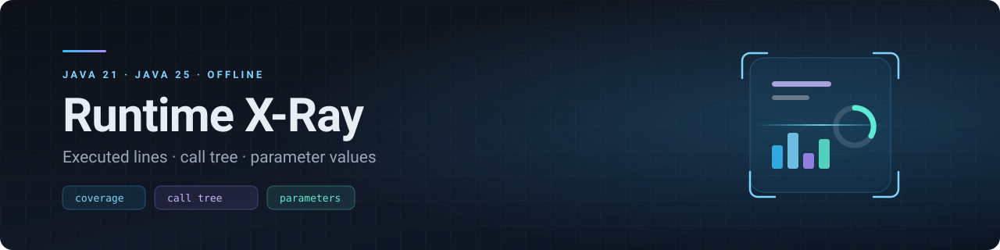

  

# Runtime X-Ray — obtenir des rapports par analyse dynamique de code Java

**Trouver la solution qui permet de produire, à l'exécution d'un programme Java, des
rapports exploitables montrant par où le code est passé.**

Il ne s'agit pas de départager des produits pour le plaisir de les classer, mais de
répondre à un besoin précis : disposer de rapports qui rendent visible le comportement
réel du code — pour l'analyser, puis le restructurer.

**→ [Voir les rapports en ligne](https://beennnn.github.io/runtime-xray/)** — les sorties
réelles, navigables dans le navigateur, sans rien installer.
**→ [Télécharger le rapport en un fichier](https://github.com/Beennnn/runtime-xray/releases/latest)** — 266 Ko, à décompresser et ouvrir hors ligne.

[Résultats et arbitrages](docs/RESULTS.md) · [Tableau comparatif](docs/COMPARISON.md) · [Fiches par outil](docs/tools/) · [Outils écartés](docs/ECARTES.md) · [Publier le rapport](docs/PUBLICATION.md) · [Clés d'évaluation](docs/EVALUATION-KEYS.md) · [Détails techniques](docs/TECHNICAL.md)

## Ce qu'on veut obtenir

| Priorité | Donnée recherchée | À quoi ça sert |
|---|---|---|
| **1** | **Les lignes de code exécutées** | Savoir ce qui a réellement tourné — et surtout ce qui n'a **jamais** tourné |
| **1** | **L'arbre d'appel** | Comprendre qui appelle quoi, et dans quel ordre |
| **2 — option** | Les valeurs passées en paramètres | Savoir **pourquoi** telle branche a été prise plutôt qu'une autre |

> Les deux premières sont l'objectif. La troisième est un **plus** : souhaitable, mais elle
> ne doit pas peser dans le choix si elle impose un compromis sur les deux autres.

Et, transversalement : pouvoir **naviguer dans le code** depuis le rapport — pour un
développeur dans son IDE, pour un non-technicien dans une page web qu'on lui envoie.

## Contraintes

| Contrainte | Conséquence sur le choix |
|---|---|
| 🔌 **Environnement déconnecté d'Internet** | Élimine tout SaaS (Datadog, New Relic, Codecov, SonarCloud) et tout outil qui télécharge ses composants au lancement |
| ☕ **Java 21 aujourd'hui, Java 25 à évaluer** | Les deux plateformes sont évaluées. L'écart est mesuré et il est important : le traçage de méthodes de JFR n'existe qu'à partir de Java 25 — [pourquoi, et ce que ça change](docs/RESULTS.md#gains-dun-portage-vers-java-25) |
| 🧭 **IntelliJ comme IDE cible** | L'intégration IDE se juge sur IntelliJ ; à défaut, une page web navigable fait office d'équivalent |
| 👥 **Deux publics** | Un développeur lit dans son IDE ; un non-technicien ouvre une page seul, sans installation ni compte |
| 🎯 **Diagnostic ponctuel** | Déployer un collecteur et un serveur pour répondre à une question est disproportionné |

## Critères d'évaluation, par ordre de priorité

1. **Facilité de mise en œuvre** — lancer l'outil sans configuration lourde.
2. **Lisibilité des rapports** — exploitables par des utilisateurs non techniques.
3. **Couverture fonctionnelle** — lignes et arbre d'appel en priorité ; les valeurs des
   paramètres en **option**.
4. **Intégration IDE** — IntelliJ, ou une page web de code annoté navigable hors IDE.
5. **Coût** — gratuit vs commercial, et si le payant se justifie.

> **Hors critères** : le temps de calcul et la RAM sont mesurés à titre de bonus, mais
> n'entrent pas dans la décision. **L'optimisation des performances est un sujet distinct,
> à traiter plus tard** — une fois le code compris, puis reconçu avec ses propres
> contraintes de performance. Choisir un outil d'analyse sur sa vitesse reviendrait à
> laisser une question ultérieure décider à la place de la question actuelle.

## Les outils comparés

Dix-huit outils recensés, **séparés en deux catégories** : ceux qui ne coûtent rien et
ceux qui exigent une licence. La frontière est structurante — elle recoupe presque
exactement la contrainte hors ligne et la question du budget.

### Sans licence — gratuit et auto-hébergeable

| Outil | Lignes exécutées | Arbre d'appel | Valeurs des paramètres | Rapport lisible hors IDE | Statut |
|---|:--:|:--:|:--:|---|---|
| **[JaCoCo](docs/tools/jacoco.md)** | ✅ | ❌ | ❌ | ✅ site HTML, code annoté | ✅ testé |
| **[async-profiler](docs/tools/async-profiler.md)** | ❌ | ✅ | ❌ | ✅ HTML autonome interactif | ✅ testé |
| **[JFR / Mission Control](docs/tools/jfr-jmc.md)** | ⚠️ | ✅ | ❌ | ❌ GUI desktop | ✅ testé |
| **[Arthas](docs/tools/arthas.md)** | ❌ | ✅ **par appel, avec n° de ligne** | ✅ **les valeurs** | ⚠️ sortie console | ✅ testé, **hors ligne prouvé** |
| **[JMC Agent](docs/tools/jmc-agent.md)** | ❌ | ✅ | ✅ | ❌ via JMC | 📄 |
| **[BTrace / Byteman](docs/tools/btrace-byteman.md)** | ❌ | ✅ | ✅ | ❌ sortie texte | 📄 |
| **[VisualVM](docs/tools/visualvm.md)** | ❌ | ✅ | ❌ | ❌ GUI desktop | 📄 |
| **[OpenClover](docs/tools/openclover.md)** | ✅ | ❌ | ❌ | ✅ HTML, couverture par test | 📄 |
| **[Glowroot](docs/tools/glowroot.md)** | ❌ | ✅ | ⚠️ | ✅ interface web embarquée | 📄 |
| **[Kieker](docs/tools/kieker.md)** | ⚠️ | ✅ | ✅ | ⚠️ diagrammes générés | 📄 |
| **[OpenTelemetry](docs/tools/opentelemetry.md)** | ❌ | ✅ | ⚠️ | ✅ via Jaeger / Tempo | 📄 |
| **[SonarQube Community](docs/tools/sonarqube.md)** | ✅ | ❌ | ❌ | ✅ web, pensé non-développeur | 📄 |
| **[IntelliJ IDEA Community](docs/tools/intellij.md)** | ✅ | ❌ | ⚠️ débogueur | ❌ dans l'IDE | 📄 |

**Coût total de cette colonne : 0 €.** Tous s'installent une fois et fonctionnent sans
connexion. Pour Arthas, le lanceur télécharge normalement ses modules chez Alibaba : le
contournement (paquet complet depuis Maven Central + `--arthas-home`) a été **testé avec
tout le trafic HTTP coupé**, et il fonctionne.

> **Les deux objectifs prioritaires sont couverts par cette seule colonne** — JaCoCo pour
> les lignes, async-profiler pour l'arbre d'appel. **Et l'option aussi** : Arthas donne les
> valeurs des paramètres. Vérifié sur l'application-cible, sous Java 21, pour 0 €.

### Avec licence — commercial

| Outil | Lignes exécutées | Arbre d'appel | Valeurs des paramètres | Prix relevé le 2026-08-20 | Statut |
|---|:--:|:--:|:--:|---|---|
| **[JProfiler](docs/tools/jprofiler.md)** | ❌ | ✅ | ✅ *method splitting* | **549 $** perpétuel · 2 199 $ flottante | ⛔ essai à activer |
| **[YourKit](docs/tools/yourkit.md)** | ❌ | ✅ | ✅ *probes* | **549 $** perpétuel · **99 $/an** académique | ⛔ essai à activer |
| **[IntelliJ IDEA Ultimate](docs/tools/intellij.md)** | ✅ | ✅ | ⚠️ débogueur | abonnement JetBrains | 📄 |
| **[APM SaaS](docs/tools/apm-saas.md)** (Datadog, New Relic, Dynatrace) | ❌ | ✅ | ⚠️ | facturation à l'usage | ⛔ **hors ligne : éliminés** |

⚠️ Deux points à vérifier **avant** d'engager une dépense, tous deux liés à la contrainte
hors ligne : JProfiler doit confirmer qu'aucune activation en ligne n'est exigée, et
YourKit ne convient en flottante que si l'on demande explicitement le **serveur de licences
auto-hébergé** (le cloud est le défaut). Démarches et stockage des clés :
**[EVALUATION-KEYS.md](docs/EVALUATION-KEYS.md)**.

Légende — ✅ testé ici · 🚧 bloqué techniquement · ⛔ bloqué par licence ou contrainte · 📄 sur documentation.

> **Le constat qui structure la décision** : les deux objectifs prioritaires sont couverts
> par **deux outils gratuits**, JaCoCo et async-profiler, et l'option l'est par un
> troisième. Ce que l'argent achèterait ne porte donc que sur l'option — réunir le tout
> dans une interface unique, et **agréger l'arbre d'appel par valeur de paramètre**, ce
> qu'Arthas ne sait pas faire. C'est-à-dire payer pour la seconde priorité.

## À quoi ressemblent les rapports

### Voir par où le code est passé, et naviguer dedans

JaCoCo produit un site HTML où l'on descend de la vue d'ensemble jusqu'au **code source
colorié ligne par ligne**. Aucun serveur, aucun compte : un dossier qu'on ouvre ou qu'on
envoie.

*Vert : exécuté. Rouge : jamais atteint. Losange jaune : condition partiellement couverte.
Un lecteur non technique voit immédiatement ce qui n'a pas tourné.*

La navigation se fait par le fil d'Ariane en haut — projet › package › classe › source —
et depuis la vue d'ensemble, triable par colonne :

### Voir l'arbre d'appel

async-profiler produit un **fichier HTML unique**, dépliable et cherchable, avec le
pourcentage de temps passé dans chaque branche :

Et la même donnée en flame graph, où la largeur d'une barre est le temps passé :

Toutes ces sorties sont versionnées dans [`reports-demo/generated/`](reports-demo/) :
elles s'ouvrent directement, sans rien réexécuter.

## Méthode

On ne compare que ce qu'on a **fait tourner**. Tous les outils analysent le même
programme, dans le même scénario déterministe, **sous Java 21 puis sous Java 25**, et
déposent leur sortie réelle dans le dépôt. Vérifié au passage : la couverture est
**identique** sur les deux versions ; c'est JFR, et lui seul, qui change. Chaque affirmation du tableau porte un statut : *testé ici* ou
*sur documentation* — une lecture de documentation n'est jamais présentée comme une mesure.

Le détail — programme analysé, scripts de collecte, mode d'intégration de chaque outil —
est dans **[docs/TECHNICAL.md](docs/TECHNICAL.md)**.

## Licence

MIT — voir [LICENSE](LICENSE).
