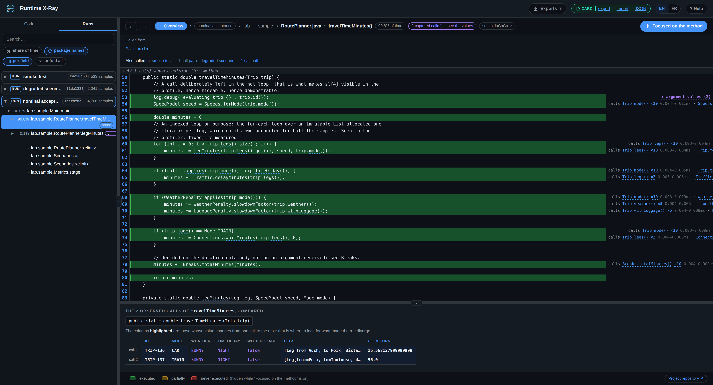

# Reading the report

> This document describes the page the tool produces: what it shows, what it keeps quiet,
> and what one can ask of it. To produce it, see [the manual](mode-emploi.md).
>
> [An example online](https://beennnn.github.io/runtime-xray/multi/)



The page is self-contained: an HTML file with no dependency, which opens from a disk, an
attachment or a forge. It calls nothing on the network.

It **opens in English** — a report gets attached to a ticket and read by someone who did not
launch the measurement. The `EN | FR` selector in the header switches everything it shows,
in one click and without reloading anything; the choice is kept for the next openings, and a
browser that announces French gets it straight away. The source code shown beside the
coverage is never translated: it is the observed application's.

> **Everything explains itself on hover.** Figures, pills, columns, buttons, flame bars,
> checkboxes: every element carries a tooltip saying what it shows, or what it does when
> clicked. This document gives the reasoning; the page gives the detail without having to
> leave it.

## The two ways in, on the left

Two tabs lead to the same code, by two different paths.

| Tab | What it shows | When it helps |
|---|---|---|
| Code | The packages, sub-packages and classes, in alphabetical order, filtered on what ran | One is looking for a class one already knows |
| Runs | The runs as roots of a call tree, from the costliest to the least | One is looking for where the run went |

In the Code view, the `executed` button switches between "only what ran" and "all the code",
code never reached then appearing in red. That second mode is what makes a whole package
nobody calls stand out — the case reading the code does not reveal.

In the Runs view, the checkboxes at the top choose which runs are shown; `%` / `ms` switches
between share of time and estimated duration; `pkg` hides the package names to clear the
method names.

The arrows navigate: up and down move the cursor, right opens then descends, left closes then
climbs, `Enter` selects. The cursor is deliberately distinct from the selection — an outline,
not a fill — so that one can walk the tree without changing what the right-hand panel shows.

### Moving from one tab to the other keeps the method

The two tabs show the same code: leaving one for the other **carries the open method along**.
From Runs, it is found and unfolded in the code tree; from Code, it is found in the call tree
— in the run being looked at, or failing that **in the first one where it ran**, and the page
then switches to that one.

If it appears nowhere in the destination view — a hidden package, a method that ran in no run
— the view opens normally and says so in a word. It never selects something else instead.

### Retracing one's steps

The two arrows at the top left replay the views visited, one way and the other — `Alt` + `←`
and `Alt` + `→`. A view is the tab, the run, the method and the call being looked at; going
back to it puts all four back.

The **breadcrumb** navigates too: clicking a package segment opens it in the code list. *(It
used to hide that package in earlier versions — the page's most natural gesture did the most
destructive thing. "Stop seeing this" lives where it always lived: at the end of the line, in
the left-hand list.)*

## What is NOT displayed, and why

This is the part one must know so as not to misread a percentage.

Four families of frames are folded onto their caller in the call tree:

| Folded away | Reason |
|---|---|
| The JDK and the standard library | Nobody opens `java.util.ArrayList` to understand their application |
| The virtual machine's inner workings | Internal compilers, native calls, trampolines: code no reader can open or fix |
| The observation tools themselves | The coverage agent and the value inspector measure, they are not part of the subject |
| Packages hidden by configuration or by click | See below |

The common criterion is simple: **does one have its source code?** The tree is there to open
methods and read them; a frame one cannot open has no place in it.

⚠️ **Folding away is not removing.** A folded frame's time is attributed to the application
method that called it. Nothing is lost, and it is even the useful information: knowing that
`Terrain.slowdownFactor` costs 8 % is actionable; knowing that `Math.pow` costs 3 % is not,
because one will not rewrite `Math.pow`.

A corollary to keep in mind: a method's percentage includes what it made the JDK do. That is
intended.

The folded classes do not disappear from the analysis for all that: the Code tab lists them
with their coverage. There it is an inventory, not a reading.

## The annotated code, in the middle

The lines carry their coverage state: green executed, yellow partially (one branch out of
two), red never reached.

The *Focused on the method* button, on by default, shows only the selected method, without
its dead lines. That is what guarantees one is looking at one method at a time rather than
being drowned in a thousand-line file. Turning it off shows the whole file.

To the right of each line, what the trace saw leave that line:

```
calls Trip.legs() ×10 0.002–0.003ms · Trip.mode() ×10 0.002–0.016ms
```

- the callee's name, clickable: it opens the method called;
- `×10`: the number of passes observed on that line;
- the spread of the durations, minimum and maximum.

### `×N`: one node per loop iteration

The `×N` is clickable. It unfolds one line per pass, in execution order.

This matters on a line inside a loop. The aggregate "10 times, between 0.002 and 0.016 ms"
says there is spread without saying where it comes from. The detail shows it: it is nearly
always the first iteration that costs — cold cache, lazy loading, just-in-time compilation —
and the following ones are flat. That difference changes the diagnosis.

The number of detailed passes is bounded: beyond it, the list stops informing and starts
weighing.

## The values, at the bottom

Values are captured on one method only, the root method named at launch (`--root`). Observing
every method would produce an unmanageable volume and would distort the measurement further.
A method without values is therefore not a method that did not run — the page says so
explicitly when one is opened.

The bottom panel puts the calls side by side: one column per field, one line per call, and
the columns that vary are highlighted.

| | id | mode | weather | withLuggage | ⟵ return |
|---|---|---|---|---|---|
| call 1 | TRIP-175 | WALK | RAIN | true | 1523.97 |
| call 2 | TRIP-176 | CAR | SUNNY | false | 52.01 |

That is the only question that really matters in front of captured values: *what changes from
one call to the next, and is that what made the execution diverge?*

In the tree, each call also unfolds into `key = value` sub-nodes. The `by field` / `by
argument` button chooses the granularity: one line per field of the value (`id = TRIP-175`,
`mode = WALK`…), or one line per argument with the raw value.

## Filtering out what one does not want to see

The JDK is always folded away. But the same holds for libraries that are not part of it and
that one treats as infrastructure: a logger, an HTTP client, an injection framework. Where
that boundary lies is not a technical question — it depends on what the team owns and what it
merely puts up with.

Two ways of saying it, and they complement each other.

### While reading the report

In the Code tab, every class and every package carries a *filter* button on hover. The path
shown above the source makes each package level clickable the same way — that is the most
direct gesture: one is reading code that does not concern one, and its path is already
written above.

The list accumulates in a band, at the top left, and it stays there: the browser remembers it
from one load to the next, there is nothing to save.

### Before the measurement, through the configuration

```bash
--hide "org.slf4j, ch.qos.logback"
```

The band's *"Stop measuring it too"* button copies the matching `HIDDEN_PACKAGES="…"` line.
It is a second, optional gesture: it is not there to save — the list is already remembered —
but so that the following runs no longer even measure that code: shorter collection, lighter
report.

A static page cannot write into your configuration file. That is also what lets it be
published as it is.

### Pruning a run's tree

Filtering tidies **code**; pruning frames a **run**. In the Runs tab, the *prune* button at
the end of a line offers two gestures:

- **cut this branch** — this node and everything leaving it disappear from the tree, *on this
  path only*: the same method called from elsewhere stays visible;
- **start again from here** — the levels above are hidden, the tree begins at this node.

That is what allows passing on **one** branch rather than a whole run: the start-up, the
plumbing and the neighbouring scenarios do not have to be explained every time.

The percentages, for their part, stay relative to the measured total, and a violet band is a
permanent reminder of what was cut, with what is needed to restore it all. **Pruning does not
correct the measurement** — the original files and the exports do not move. That is also why
the overview's time graph follows the same pruning: two places in the page must not tell two
stories.

Pruning is kept like the rest of the annotations: in the browser first, then in a file beside
the runs — which the page writes itself when it is served by the tool, or which one drops
oneself after exporting it. That is what makes it final for everyone who opens the report:
[Annotating the runs](annotations.md).

## Two trees, two questions — both get used

The phrase "call tree" covers two different objects in this page. They do not answer the same
question, and the confusion is expensive.

| | The aggregated tree | One call's path |
|---|---|---|
| Where | Runs tab, on the left | "calls …" annotations in the code, on the right |
| Produced by | async-profiler | Arthas |
| Answers | "Where does the time go, all calls taken together?" | "What did *that* call do, in order?" |
| How | By polling: the JVM is photographed a thousand times a second, and the photographs are added up. Nothing is slowed down, but a brief call may escape every photograph | By instrumentation: every entry and exit is noted. Nothing escapes, but only a few invocations are followed, and they are slowed down |
| Cannot | Tell two calls of the same method apart: it is a sum | Say what the application does *in general*: it is one example |

Hence the division of labour: one looks for where to look in the aggregated tree, then opens
the method and reads what happened there in one call's path.

## Several runs in the same page

Each launch adds a run. All appear as roots of the tree, and the checkboxes choose which ones
are shown. On an open method, the page indicates the other runs where it also ran, and the
number of distinct call contexts — one click switches.

The **"Called from"** band, under the breadcrumb, shows **who calls** — and nothing else. The
open method is already named just above, and it ended each of the paths identically: it has
been taken out of them, as has the "100 %" of a single context, which was true without
teaching anything. With several contexts, each one's share stays shown, since that is what
tells them apart.

Three identities per run, and each has its reason: an **identifier** assigned at launch, which
never changes; the **name given by `--name`**, which says what one thought one was measuring;
the **name put on afterwards**, which says what one understood. Without `--name`, the
shortened identifier is what shows — never an invented label.

### A run's card

This is the band marked **card**, under the breadcrumb in the overview: what *you* add to a
run to recognise it later — name, description, labels. It fits on one line: shortened
identifier, name editable in place, description, labels. The launch name and the full
identifier are in the tooltips — they cannot be edited, so they need not take up the line.

**No measurement is changed by it.** The card is placed beside and taken away without losing
anything: it is the only thing on this page that comes from a human, and it is kept separate
so that it can never be confused with what was measured.

To the right of the band, a status says where it is kept: *kept in this browser*, or *up to
date* / *unsaved* when the page is served by the tool. The actions — save, export, import,
view the JSON — are in the top bar, under **card**. The detail of the three modes:
[Annotating the runs](annotations.md).

## The raw outputs, and the **Exports** menu

Everything the run wrote is reachable in two places, which show the same list: the **Exports**
menu, at the top left, and a section at the bottom of the overview. Grouped by origin:
JaCoCo's HTML reports, async-profiler's native profile and its inverse, the folded stacks,
Arthas' values and trace, the run's log, the context.

An **"Open formats"** heading carries the same measurements rewritten as `perf script`, as
`cpuprofile`, as LCOV and as JSON. Those four stay **named even when absent**, greyed out: a
capability that lived only in a command-line option does not exist for whoever reads the page.
A click then says how to produce them, without running a single measurement again. See
[Taking the result into another tool](exports.md).

This is not completeness for form's sake. This page is a summary: it folds frames away,
aggregates calls, hides packages. Each of those choices may turn out wrong on a case nobody
foresaw, and the page itself may stop opening. The original outputs therefore stay reachable
in one click — that is what separates a verifiable report from a report to be taken on trust.

## `rapport.md` — the same thing, readable in a forge

Beside `index.html`, the tool writes a `rapport.md`. It is not a second report: it is the
same one, reduced to what reads without interaction — coverage per package, code never
executed named, the costliest methods, the compared calls.

It exists for a precise reason: a forge shows a `.html` file as source code, not as a page.
Markdown, on the other hand, is rendered natively by GitHub as by GitLab, private repositories
included, with no Pages, no third-party service and no setting. It is the only format that
reads where the code is reviewed.

Its coverage rate carries a qualification that matters: it is computed over all the bytecode
handed over for analysis. If the analysis covers a whole dependency, most of it has by
construction no reason to run, and that rate then says mostly how big that dependency is.

## What the page does not say

- It does not count calls, except on the traced lines. The aggregated tree is a poll: it gives
  shares of time, not numbers of invocations.
- The root method's cost is overestimated, because value inspection works inside the same run.
  The page shows this and gives the figure. `--no-values` on a second pass gives undisturbed
  times.
- It measures neither memory nor allocations. Other tools do; that was not the subject of
  [the study](../resultat/resultats.md).
- It describes one run, not a program. What did not run that day appears as never executed —
  which is exact, and does not mean useless.
