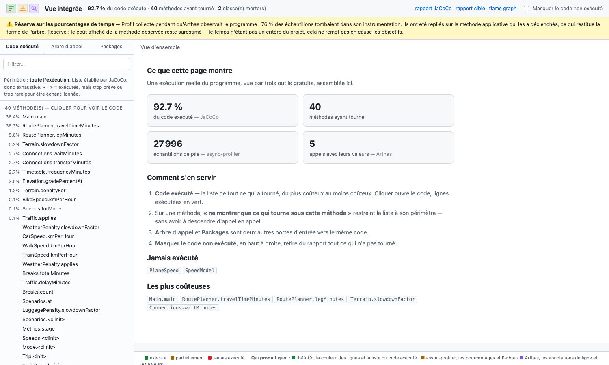
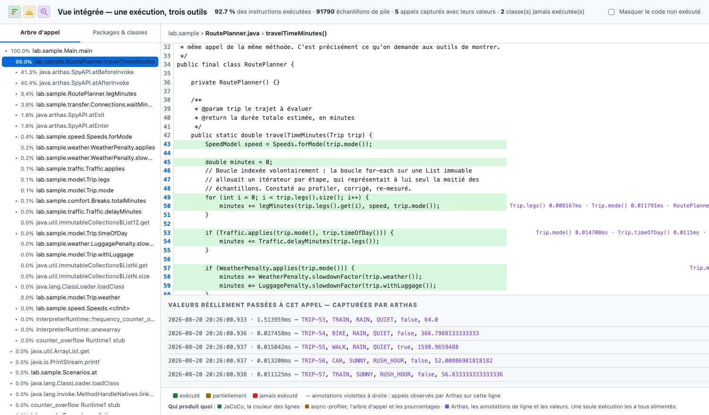

# La solution retenue — une exécution, trois outils, une vue

> Sans licence · hors ligne · 0 € · vérifié de bout en bout sous Java 21.

**[→ Voir la vue intégrée](https://beennnn.github.io/runtime-xray/multi/)**



*À l'ouverture : ce que l'exécution a produit, et à gauche **la liste de tout le code qui a
tourné**, du plus coûteux au moins coûteux. Pas d'arbre à descendre — la liste est
exhaustive, établie par JaCoCo.*



*Un clic ouvre le code : lignes exécutées en vert, annotations violettes indiquant quel
appel part de quelle ligne et en combien de temps, et en bas les valeurs réellement passées.
Le bouton « ne montrer que ce qui tourne sous cette méthode » restreint la liste de gauche
à ce périmètre.*

## Les trois outils et leur rôle

| | Outil | Ce qu'il apporte | Ce qu'il ne sait pas faire |
|---|---|---|---|
|  | **JaCoCo** | Les lignes exécutées, à la ligne près, et surtout **celles qui ne l'ont jamais été** | Rien sur le temps ni sur l'ordre des appels |
|  | **async-profiler** | L'**arbre d'appel** agrégé sur toute l'exécution, avec la part de temps de chaque branche | Ne prouve jamais qu'un code n'a pas tourné (il échantillonne) |
|  | **Arthas** | Les **valeurs des paramètres**, et l'arbre d'**un seul** appel avec ses numéros de ligne | Pas de rapport transmissible : c'est une console |

Les trois se complètent exactement : ce que l'un ignore, un autre le couvre.

## Le protocole : une seule exécution

[`tools/run-all.sh`](../../tools/run-all.sh) lance **un seul processus** avec les deux agents
attachés au démarrage, puis y branche Arthas pendant que les appels ont lieu :

```
java -javaagent:jacoco-agent.jar=destfile=…          ← instrumente le bytecode
     -agentpath:libasyncProfiler.dylib=start,…       ← échantillonne les piles
     -jar sample-app.jar --iterations 24000000       ← le temps de s'attacher
                                                     ↳ arthas-boot --arthas-home … -f watch-params.as
```

```bash
./tools/run-all.sh
```

### Pourquoi une seule passe, alors qu'Arthas perturbe la mesure

La question mérite d'être tranchée explicitement, parce que la perturbation est réelle et
importante — mais elle ne touche **pas** ce que le projet cherche.

Voici, objectif par objectif, ce que la passe unique donne :

| Objectif | État en passe unique | Vérifié comment |
|---|---|---|
| **1 — lignes exécutées** | ✅ **intact** | Le script contrôle à chaque exécution que la classe observée conserve sa couverture. Arthas la *retransforme*, ce qui aurait pu l'effacer : ce n'est pas le cas |
| **1 — arbre d'appel (la forme)** | ✅ **intact** | La structure des appels reste complète : `RoutePlanner → legMinutes → Terrain…`. Rien ne disparaît |
| **2 — valeurs des paramètres** | ✅ intact | C'est justement Arthas qui les fournit |
| *pourcentages de temps* | ⚠️ **faussés** | Plus de 80 % des échantillons tombaient dans l'instrumentation d'Arthas (`SpyAPI.atBeforeInvoke` 41 %, `atAfterInvoke` 40 %) |

**Ce qui est dégradé est le seul indicateur qui ne soit pas un critère du projet.** Le
temps de calcul a été explicitement classé hors critères : l'optimisation des performances
est un sujet distinct, à traiter plus tard, une fois le code compris et reconçu. Sacrifier
la précision d'une mesure de temps pour obtenir les trois données en un seul lancement est
donc un bon échange.

### L'atténuation appliquée

Plutôt que d'afficher un profil trompeur, la vue intégrée **replie les frames d'Arthas sur
la méthode applicative qui les a déclenchées**. Les échantillons restent comptés, mais
attribués au code métier plutôt qu'à l'outil d'observation : la forme de la distribution
est restituée, et l'arbre redevient lisible.

Une bannière affiche la réserve en haut de la vue, avec la part d'échantillons concernée —
on ne masque pas le problème, on l'annonce.

**Réserve qui subsiste** : le coût affiché de la *méthode observée* reste surestimé, car on
mesure aussi le travail de l'instrumentation. Les autres méthodes ne sont pas affectées.

### Si les pourcentages doivent être justes

```bash
java -jar runtime-xray.jar --java "…" --no-values      # mesure seule, profil propre
java -jar runtime-xray.jar --java "…" --root "…"       # inspection, sur une seconde passe
```

Deux exécutions du même scénario déterministe : la mesure d'abord, sans rien qui
instrumente, puis l'inspection. À réserver au jour où l'on s'intéressera vraiment aux
temps — c'est-à-dire pas dans le cadre de cette étude, où le temps n'est pas un critère.

### Ce qui a été vérifié, et qui n'allait pas de soi

**Les trois agents cohabitent sans corrompre la couverture.** Arthas retransforme les
classes qu'il observe, alors que JaCoCo les a déjà instrumentées — la couverture aurait pu
être perdue sur ces classes précises. Le contrôle est donc automatique, à chaque lancement :

```
▶ Contrôle d'intégrité : la couverture a-t-elle survécu à la retransformation d'Arthas ?
   RoutePlanner : 93 instructions couvertes — OK
```

## La vue intégrée

L'orchestrateur produit **un fichier HTML autonome** à partir des sorties machine des trois
outils. Il ne mesure rien : il assemble.

| Source lue | Ce qu'elle alimente dans la vue |
|---|---|
| `jacoco.xml` | La couleur des lignes, et la ligne de début de chaque méthode |
| `profil.collapsed` | L'arbre d'appel et les pourcentages |
| `trace-calltree.txt` | Les annotations « quel appel part de cette ligne, en combien de temps » |
| `watch-params.txt` | Le panneau des valeurs réellement passées |
| les `.java` du projet | Le code affiché |

### Ce qu'elle permet

- **Deux navigations, au choix** : par **arbre d'appel** (on suit l'exécution) ou par
  **packages et classes** (on cherche un fichier précis). Les deux mènent à la même vue de
  code.
- **Tout sous les yeux** : en sélectionnant un nœud, on voit d'un coup les lignes
  exécutées, les appels qui en partent, leur coût, et les valeurs passées.
- **Masquer le code non exécuté** : une case à cocher retire du rapport les classes jamais
  atteintes et masque les lignes mortes, en indiquant combien ont été repliées. C'est la
  réponse à « exporter un résultat nettoyé, sans être pollué par le code inutilisé ».
- **Autonome** : un seul fichier, aucune ressource externe, aucun serveur — il s'ouvre
  hors ligne et s'envoie en pièce jointe.

### Ses limites, énoncées

- Les annotations de ligne ne couvrent que la méthode tracée par Arthas — tracer tout le
  code produirait un volume ingérable (129 Mo pour 10 s sur une seule méthode chaude).
- Les valeurs affichées sont celles de **quelques appels**, pas une agrégation par valeur.
  C'est précisément ce que les outils commerciaux savent faire en plus.
- L'arbre d'appel est **échantillonné** : une méthode rare peut n'y pas figurer. Pour
  savoir ce qui n'a jamais tourné, c'est la couverture qui fait foi, pas l'arbre.

## Ce que ça coûte

| | |
|---|---|
| Licences | **0 €** |
| Connexion pendant l'exécution | **aucune** |
| Connexion pour installer | oui, une fois — JaCoCo et Arthas depuis Maven Central ou un miroir interne, async-profiler par le gestionnaire de paquets. Le critère portant sur l'exécution, ce n'est pas une contrainte |
| Installation | trois outils, tous scriptés dans [`tools/`](../../tools) |
| Exécution | deux lancements du programme, ~30 s chacun |
