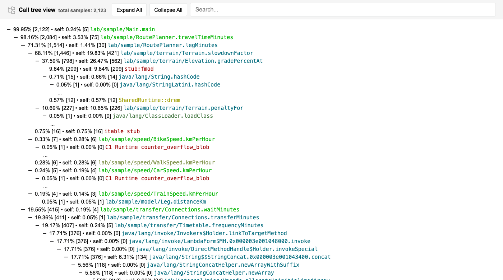
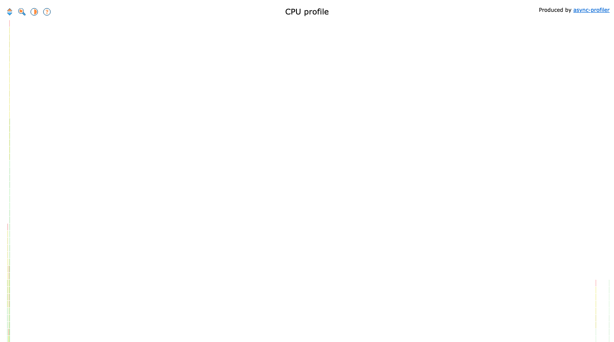

# async-profiler

> **Statut : ✅ testé ici** — sorties dans [`reports-demo/generated/async-profiler/`](../../reports-demo/generated/async-profiler/)

## Ce que c'est

Un profiler par échantillonnage pour la JVM, sous forme d'agent natif. Il interrompt
régulièrement le programme, note la pile d'appel, et agrège le tout en un arbre.

## Sa philosophie

**Mesurer sans déformer.** Les profilers qui instrumentent chaque méthode changent le
comportement qu'ils mesurent — la JVM n'optimise plus pareil. async-profiler échantillonne
à intervalle fixe, avec un surcoût de quelques pourcents.

Le prix de cette discrétion : c'est **statistique**. Une méthode rare peut n'apparaître
dans aucun échantillon. Il ne peut donc jamais affirmer qu'un code n'a *pas* tourné —
c'est exactement le complément de JaCoCo.

## Ce qu'il sait faire

| Capacité | |
|---|---|
| Arbre d'appel | ✅ complet, avec % de temps par branche |
| Flame graph | ✅ HTML autonome interactif |
| Lignes exécutées | ❌ (échantillonnage : aucune preuve de non-exécution) |
| Valeurs des paramètres | ❌ |
| Profils mémoire, verrous, temps réel | ✅ (`alloc`, `lock`, `wall`) |
| Formats | HTML (flame graph, arbre), collapsed, JFR |

## Son interface

Un **fichier HTML unique**, sans dépendance externe.

**Vue arbre** — dépliable, cherchable, avec pourcentage et compte d'échantillons :



**Flame graph** — la largeur d'une barre est le temps passé ; on clique pour zoomer :



## Comment on navigue dedans

- **Hors IDE** — un seul fichier `.html` : on l'ouvre, on déplie, on cherche un nom de
  méthode, on zoome sur une branche. Envoyable par pièce jointe, lisible hors ligne.
- **Dans IntelliJ** — IntelliJ IDEA **Ultimate** embarque async-profiler comme moteur de
  son profiler intégré. Community, non. Autrement dit : le moteur est gratuit, c'est le
  confort de l'IDE qui est payant.
- **Pas d'intégration GitHub / GitLab** — un arbre d'appel n'a pas sa place dans une diff.

## Mise en œuvre

```bash
brew install async-profiler       # une fois, hors ligne ensuite
./tools/async-profiler/collect.sh
```

Puis un seul flag JVM. **Aucune modification du code analysé.**

> ⚠️ Sur macOS, `perf_events` n'existe pas : utiliser `event=itimer`.
>
> ⚠️ Sans `-XX:+DebugNonSafepoints`, les frames sont attribuées au mauvais numéro de ligne.
>
> ⚠️ Sans `include=lab/sample/*`, 60 % des échantillons sont les threads du compilateur
> JIT — exact, mais illisible pour qui cherche son propre code.

## Licence et coût

**Apache 2.0**, open source, **0 €**. Binaire natif installé une fois : fonctionne hors ligne.

## Ce qu'on peut en espérer

**Seul** : la meilleure réponse gratuite à « montre-moi l'arbre d'appel », dans un format
qu'on partage sans rien installer chez le destinataire.

**Combiné** : avec JaCoCo, on couvre deux des trois besoins du brief pour 0 €, hors ligne.
Il sait aussi écrire au format JFR, donc alimenter Mission Control.

## Mesuré ici

Après affinage du programme, **71 % des échantillons ont une feuille dans `lab.sample`**,
et les cinq premières feuilles du profil sont des méthodes métier. Le profil a d'ailleurs
servi à corriger trois défauts réels du programme d'exemple — voir
[TECHNICAL.md](../TECHNICAL.md#affinages-décidés-à-la-mesure-pas-au-jugé).

## Facile / moins facile

**Ce qui est facile.** Un flag, un fichier HTML qu'on ouvre ou qu'on envoie. Zéro configuration une fois installé.

**Ce qui l'est moins.** Écarter le bruit : sans `include=`, 60 % des échantillons sont le compilateur JIT, et sans `DebugNonSafepoints` les numéros de ligne sont faux — deux options qu'il faut connaître. Et **interpréter un profil échantillonné** : il ne prouve jamais qu'un code n'a pas tourné.
