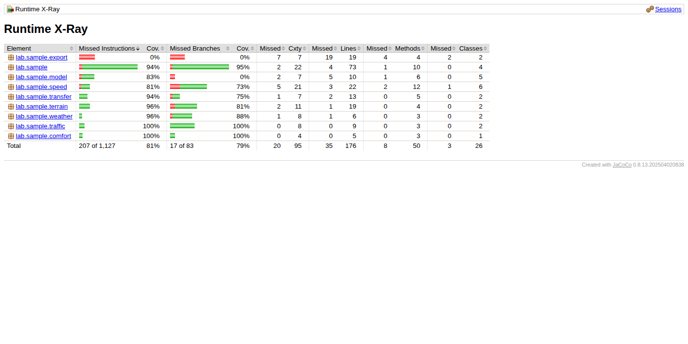
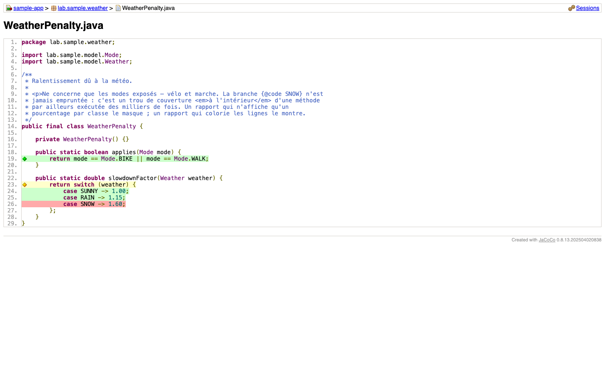
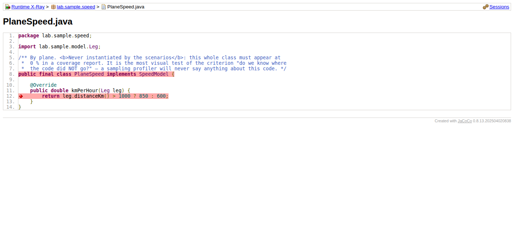

# JaCoCo

> **Statut : ✅ testé ici** — sortie versionnée dans [`reports-demo/generated/jacoco/`](../../reports-demo/generated/jacoco/)

## Ce que c'est

La référence de la couverture de code Java. Un agent JVM qui note, pendant l'exécution,
quelles instructions et quelles branches ont été empruntées, puis produit un rapport.

## Sa philosophie

**Ne rien supposer, tout compter.** JaCoCo n'échantillonne pas : il instrumente le
bytecode et enregistre chaque passage. Conséquence directe et précieuse : il sait ce qui
**n'a pas** été exécuté — ce qu'aucun profiler par échantillonnage ne peut affirmer.

Corollaire : il ne dit rien du *temps*, ni de l'ordre des appels. Il répond à « par où
est-on passé ? », pas à « combien de temps y a-t-on passé ? ».

## Ce qu'il sait faire

| Capacité | |
|---|---|
| Lignes exécutées | ✅ à la ligne près |
| Branches | ✅ partiellement couvertes signalées |
| Complexité cyclomatique | ✅ par méthode |
| Arbre d'appel | ❌ |
| Valeurs des paramètres | ❌ |
| Formats de sortie | HTML, XML, CSV |

## Son interface

Un site HTML statique, à trois niveaux de navigation.

**Vue d'ensemble** — triable par colonne, on repère d'un coup d'œil les packages faibles :



**Code source annoté** — le niveau qui compte :



Le code lui-même est colorié : vert exécuté, rouge jamais atteint, jaune partiellement
couvert. Les losanges dans la marge détaillent les branches. Le fil d'Ariane en haut
(*sample-app › lab.sample.weather › WeatherPenalty.java*) permet de remonter.

**Une classe entière jamais exécutée** ressort intégralement en rouge :



## Comment on navigue dedans

- **Hors IDE** — on ouvre `index.html` dans un navigateur et on clique : package → classe
  → source. Aucun serveur, aucun compte. C'est un dossier de fichiers : on le zippe, on
  l'envoie, le destinataire l'ouvre. **C'est le canal le plus simple pour un
  non-technicien**, et il fonctionne hors ligne.
- **Dans IntelliJ** — le fichier `.exec` s'importe (*Run › Show Coverage Data…*) et la
  couverture s'affiche dans la marge de l'éditeur, avec la navigation habituelle de l'IDE.
  *(À confirmer sur poste : non vérifié ici.)*
- **Dans GitLab** — visualisation native de la couverture dans la diff d'une merge
  request, à condition de convertir le XML JaCoCo au format Cobertura.
- **Dans GitHub** — pas de support natif ; il faut un service tiers (Codecov, Coveralls),
  donc une connexion sortante — **incompatible avec la contrainte hors ligne**.

## Mise en œuvre

```bash
./tools/jacoco/collect.sh
```

Le script fait trois choses : récupérer le jar de l'agent, lancer l'application avec
`-javaagent`, puis générer le rapport. **Aucune modification du code analysé.**

> ⚠️ Le mode habituel de JaCoCo est le plugin Maven qui mesure la couverture **des tests**.
> Ce n'est pas la question posée ici : on veut la couverture d'une **exécution réelle**.
> D'où l'usage de l'agent directement.

> ⚠️ `-Djacoco.outputDirectory` n'est pas honoré par le goal `report` — le rapport
> atterrit dans `target/site/jacoco` quoi qu'on fasse. Le script copie explicitement.

## Licence et coût

**EPL 2.0**, open source, **0 €**. Aucune limite d'usage, aucun appel réseau à
l'exécution : le jar s'installe une fois et fonctionne hors ligne.

## Ce qu'on peut en espérer

**Seul** : la réponse complète et définitive à « par où le code est passé », avec un
rapport navigable exploitable par un non-développeur. C'est déjà le besoin n° 1 du projet.

**Combiné** : son XML alimente SonarQube (interface web plus soignée, pensée pour un
public non technique) ou la visualisation native de GitLab. Il se combine sans conflit
avec un profiler d'arbre d'appel, les deux agents cohabitant sur la même JVM.

## Mesuré ici

Sur `sample-app`, sous Java 21 : **91,1 % des instructions**, **81,8 % des branches**.
`PlaneSpeed` et la branche `SNOW` ressortent bien comme non exécutées.

## Comparable à

- **[OpenClover](openclover.md)** — Même métier — la couverture — mais il conserve le lien avec **le test** qui a couvert chaque ligne. Plus riche sur cet axe, plus intrusif : il instrumente à la compilation, pas à l'exécution. Pour la couverture d'un **run**, JaCoCo est plus direct.
- **[SonarQube](sonarqube.md)** — Ce n'est pas un concurrent : il **consomme** le XML de JaCoCo. Il l'affiche mieux, avec un historique — au prix d'un serveur à maintenir.
- **[IntelliJ IDEA](intellij.md)** — Autre consommateur, pas autre mesureur : il affiche le `.exec` dans la marge de l'éditeur.
- **[async-profiler](async-profiler.md)** — **Complémentaire, jamais substituable.** JaCoCo sait ce qui n'a *pas* tourné, un profiler par échantillonnage ne le saura jamais.

## Facile / moins facile

**Ce qui est facile.** Obtenir un rapport : un flag JVM, trois commandes scriptées. **Le lire sans formation** : le code colorié se comprend sans savoir ce qu'est une branche.

**Ce qui l'est moins.** Mesurer une **exécution** plutôt qu'une suite de tests — c'est l'usage minoritaire, moins documenté. L'afficher dans GitLab (conversion Cobertura à faire) ou GitHub (service tiers, donc en ligne). Et **masquer les lignes non exécutées à l'intérieur d'un fichier** : impossible nativement, seule l'exclusion de classes entières l'est.
